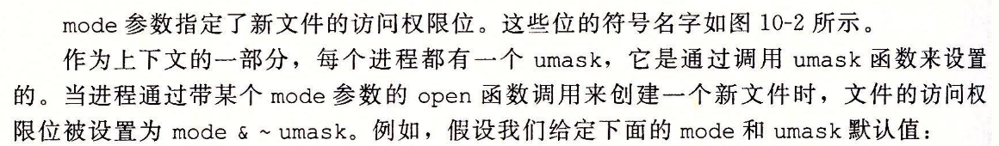

# 系统IO

[TOC]

输入输出是在主存和外设之间复制数据的过程。

Linux 的内核记录有关打开文件的信息，应用程序只需要记住描述符。

- Linux的shell创建的每个进程开始时都有三个打开文件，标准输入（0）,标准输出1,标准错误2。头文件unistd.h定义了$STDIN\_FIFENO,STDOUT\_FIFENO,STDERR\_FIFENO$ 

## 文件类型

- 普通文件，包含任意数据，应用程序区分文本文件和二进制文件。文本文件包含ascii码和Unicode字符的普通文件，二进制文件是其他所有文件。

- 目录文件，包含一组链接的文件，每个连接吧文件名映射到一个文件。每个目录至少含有两个文件，分别是"."到目录自身,".."到父目录

- 套接字

  Linux内核将文件组织为目录层次结构。由/的根目录决定

  

## 文件打开和关闭

### 权限位

## 读写文件

size_t和ssize_t差别是ssize_t是有符号的,大小定义为long

## RIO包读写

RIO缓冲和无缓冲不能交叉调用

### RIO无缓冲

对于同一个描述符，可以交错调用rid_readn和rio_writen，rio_readn函数在遇到eof只能返回一个不足值，rio_writen则绝不返回不足值

### RIO有缓冲

rio_readlineb（读文本行）函数最多读Maxlen-1个字节，余下字符留给NULL,超过maxlen-1的文本行被截断。

## 读取文件元数据

stat数据结构成员

## 读取目录

d_name是文件名，d_ino是文件位置。

如果出错，readdir返回NULL,设置errno,唯一区分错误和流结束情况是检查调用readdir后errno是否被修改

closedir关闭流是否资源

## 共享文件

内核用三个相关数据结构表示打开文件

- 描述符表

- 文件表

- V-node表

  

  文件描述符例子

  

  多个文件描述符都有自己的文件位置，对不同描述符的读操作可以从不同位置获取数据

  > 注意文件描述符表是每个进程各自的，修改后不影响其他进程，而打开文件表是进程共享的，V-node表也是所有进程共享信息。打开文件表只有在引用计数为0才消失。文件表也属于进程上下文
  
  

## IO重定向

dup(4,1)，删除了a的v-node表项。B引用计数增加。复制描述符表项oldfd到newfd,覆盖newfd以前内容。dup（4，1）就是标准输出重定位到文件描述符为4的文件。dup(5,0)就是标准输入定位到文件描述符5对应的文件表项。

dup2函数复制描述符表项，会在复制oldfd之前关闭newfd。文件表项删除只有是在refcnt=0才删除。

printf打印格式串时，是Unix\IO

## 标准IO

## IO函数选用

- 只要有可能就选用标准IO
- 不要使用scanf或者rio_readLineb读取二进制文件。他们是设计用来都文本文件
- 对网络套接字使用RIO函数

流冲突限制问题

对套接字使用lseek是非法的，对第一个限制可以通过采用每个输入前刷新缓冲区完成。第二个则只能对同一个打开的套接字描述符打开两个流，一个读，一个写，释放则都要释放。

##  

