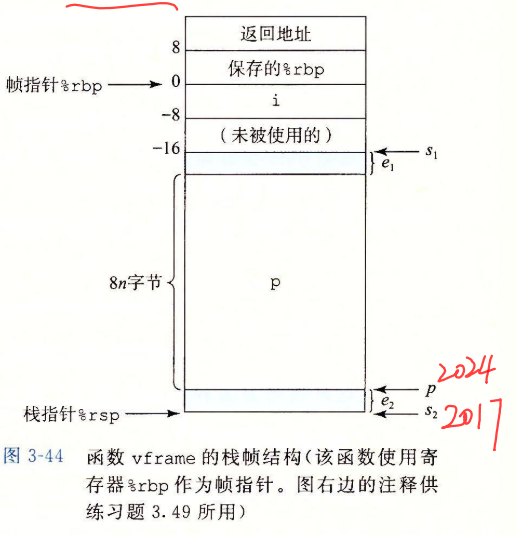

# 第三章 程序机器表示

[TOC]

### IA32内存管理

保护模式

- 平坦分段模式

  - 所有段均被映射到32位物理空间
  - 程序至少两个段：代码段和数据段；
  - 全局描述符表。
- 多段模式

  - 局部描述符表
- 分页模式


## 程序编码

```shell
gcc -Og p1.c p2.c -o p ;使用原始优化
gcc -Og -S mstore.c ;编译生成汇编代码 -c 编译并汇编
```

预处理器扩展源代码，插入所有用include命令指定的文件，并扩展所有用define定义的宏。编译器产生两个文件的汇编代码，然后汇编器产生二进制目标文件，但还未填入全局值的地址，还需链接器将两个文件和实现库函数代码合并，生成p

对于机器级编程，两种抽象很重要：1.指令集体系结构 2.虚拟地址

- x86是CISC,指令长度从1到15字节不等。

单条指令不能完成内存到内存

call参数压栈或者说寄存器赋值顺序 是从后往前，rbp保存是在调用函数后

printf参数是先处理后面，最后按照顺序打印

> 无符号数使用CF,ZF,PF/ 命令 cmove,comvz, (cmovp,cmovpe ppt上，奇偶校验，a,b,e,n,c)
>
> 有符号数SF,ZF,OF (g,l,e,n,o)

### 数据格式注意

```asm
;mov两个数必须有一个是寄存器寻址，寻址的参数只能是1,2,4,8的倍数
imulq $16,(%rax,%rdx,8) ;计算16*地址rax+rdx*8位置的值，并存到该位置，64位乘法rdx存放高64位，rax存放低64位

incq 16(%rax) 指定位置+1 decq
subq %rdx,%rax;结果存到rax

movb/w/l/q 目标要匹配
//移位指令
salb/w/l/q 左移7/15/31/63
SHR 逻辑移位，填0
SAR 算术，填符号位

sarq %cl,%rax 算数移位cl
salq $4, %rax 左移4

leaq (%rdx,%rdx,2),%rax 移地址;本质上就是加法计算
xorq %rsi,%rdi 

cqto 符号拓展到八字节
cmove 相等才继续执行

;sf,of,zf,cf都是条件码

movabsq 目的只能是寄存器
```


生成四字节值并以寄存器作为目的可以把高位设置为0

### 移位操作

移位操作对字长W的数据操作，移位量是%cl的低m位决定的，$2^m=W$ ,高位被忽略

sar执行算术移位，shr逻辑移位，>>

移位操作设置进位标志，溢出标志设置为0。INC和DEC设置溢出和零标志，不设置进位标志

#### 对于128位乘法

- rdx高64位，rax低64位

- 除法商存放rax,余数存放在rdx

## 控制

条件码：移位操作，进位标志设置为最后一个被移出的位，溢出标志设置为0，INC,DEC会设置溢出标志和0标志，但是不设置进位标志

条件控制

C语言if-else汇编实现在机器执行过程翻译为

```c
if(!t)
 	goto false;
then-statement;
goto done;
false:
	else_statement;
done:
	
```


条件传送：支持16，32，64位，但是不支持单字节的条件传送。**无条件指令的操作数格式显式编码在指令名中。基于条件传送代码对*then-expr和else_expr均求值*，最后选择基于test_expr**

跳转指令：**产生目标代码文件时，汇编器会确定所有带标号指令的地址，并将跳转目标编码为跳转指令一部分。通常，跳转指令的目标地址紧跟在跳转指令后面那条指令的地址差作为编码，也可以使用绝对地址** 

循环/switch确定标号:

switch跳转表在只读数据段


## 过程和数组分配访问

过程形式多样：函数、方法、子例程、处理函数。需要传递控制，传递数据，分配释放内存


### 异质数据结构

- 结构体
  - 对齐是开始地址要是该大小的整数倍，比如double地址就要是八字节的整数位
- 联合 union


## 程序栈帧

下面两个都是典型的栈帧结构，当过程需要的存储空间超过可存放的大小时，就会在栈上分配空间。大多数过程栈帧都是定长，过程开始就分配好了。


需要注意的是，被保存的寄存器第一个是 old rbp。大多数栈帧定长，过程开始就分配完毕，但是部分过程需要变长栈帧。如果过程P可以传递最多6个整数值，但是Q需要更多参数，P可以在调用Q之前在自己的栈帧保存这些参数。

为提高效率，X86-64只分配字级所需的栈帧部分。**很多函数都不需要栈帧**，当所有局部变量都可以保存在寄存器内，该函数不调用其他函数时，就可以这样处理。


### 栈上局部存储

1. 寄存器不足存放所有本地数据
2. 对一个局部变量取地址
3. 某些局部变量是数组或者结构。

#### 变长栈帧实现

调用alloca就发生 此类情况。这个标准库函数可以在栈上分配任意字节存储。需要注意字节对齐。以下代码请求在栈上分配8n个字节。分配情况：


为管理边长栈帧，x86-64使用%rbp作为帧指针，当使用帧指针时，栈帧的结构组织和vframe函数的情况一样，这是个被调用者保存寄存器。在程序执行的整个过程，%rbp指向那个时刻栈的位置。**用固定长度的局部变量相对%rbp的偏移量来引用**。

> 关于栈指针对齐：一个递归保证，从main函数起的每一个函数依赖函数入口%rsp/16余下8，保证执行call其他函数%rsp可以整除16

这里之所以使用$8n+22$是后续会向下舍入到最接近16的倍数，这里数据是地址16整数倍开始访问。而申请的空间大小是在原来基础上选择最接近16的空间块大小。



### 内存越界和缓冲区溢出

缓冲区溢出会使得程序执行他本来不想执行的代码，通常输入个程序一个字符串，这个串含有可执行代码的字节编码，称为攻击代码，另外就是一些字节会用一个指向可攻击代码的指针覆盖返回地址，这样ret就会返回到攻击代码区。

攻击原理（3个采分点）：

- 向程序输⼊缓冲区写⼊特定的数据，例如在 gets 读⼊字 符串时，使位于栈中的缓冲区数据溢出。
- ⽤特定的内容覆盖栈中的内容，例如函数 返回地址等，使得程序在读⼊字符串，结束函数 gets 从栈中读取返回地址时，错误 地返回到特定的位置，执⾏特定的代码，达到攻击的⽬的

解决办法：

- 代码避免溢出漏洞，比如使用strcnpy指明大小

- 限制可执行代码区域

- 金丝雀，栈破坏检测：在栈帧任何局部缓冲区和栈状态之间存储一个特殊的金丝雀值，程序每次运行随机产生。使用$-fno-stack-protector$阻止Gcc产生此类代码

  

- 栈地址随机化：栈的地址程序每次运行都有变化。注意空操作雪橇，就是建立nop程序，划过这个随机化区域。比如256的nop sled通过$2^{15}$就可以破解$2^{23}$的随机化。


## 浮点代码


