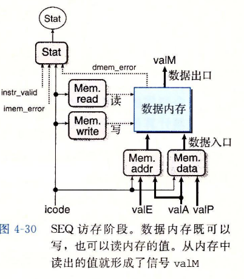
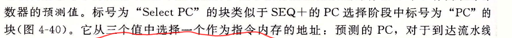

# 第四章_处理器体系结构Y86

[TOC]

## 指令和程序员可见状态

icode唯一确定是否需要NeedValC，NeedRegids。ifun则是指定所选择的功能

指令集架构连接软件和硬件。


程序员可见状态


stat表明程序执行的总体状态，指明是否是异常。

Y86

- 将movq分为irmovq,rrmovq,mrmovq,rmmovq显示指明源和目的格式。内存传送指令内存引用是简单基址寻址和偏移量形式。

- addq,subq,andq,和xorq只对寄存器数据操作。

- jmp,jle,jl,je,jne,jge，jg根据分支指令类型和条件代码选择分支

- 条件传送 cmovl~,只有当条件码满足才更新寄存器值

- call指令将返回地址压栈，跳转到目的地址。ret从这样调用返回。

- pushq,popq指令实现入栈和出栈。

  

### 指令编码

字节在1~10之间，高四位代码部分，第四位是功能码。功能是只有在一组相关指令共用一个代码有用。


程序寄存器存在cpu的一个寄存器文件内，寄存器文件是一个小的，以寄存器ID为地址的随机访问存储器。指明不访问任何寄存器用0xf表示。


### RISC和CISC

x86是复杂指令集计算机CISC，手机等嵌入式系统使用RISC


#### Y86异常

Y86遇到此类异常，简单的让处理器停止执行


#### Y86程序


Y86将常数加载到寄存器是因为不能在算术指令使用立即数


### Y86指令执行


### HCL语言

主要三部分：计算对位进行操作的函数组合逻辑，存储为的存储器单元，以及控制存储器单元更新的时钟信号。

```C
bool xor=(!a&&b)||(!b&&a)
```

HCL所有字级信号声明为int，不知道字大小。

```c
//多路复用
word Out=[
 select:expr1;
 select2:expr2;
 ……
 1:something //指定默认情况
]

//集合关系
bool s1=code in{2,3};
```

#### 存储器和时钟

**寄存器文件读类似组合逻辑，写类似寄存器，只在时钟上升沿更新**

为产生时序电路，需要引入按位存储的设备，存储设备由一个时钟控制。在上升沿加载

**组合电路从本质上，不存储任何信息，寄存器文件不是组合电路，因为有内部存储，但是读数据表现为一个组合逻辑块向寄存器写数据，由时钟信号控制，读数据是不需要时钟控制的，向寄存器写数据时钟信号控制的**

考虑两类设备:控制方式类似将值加载到时钟寄存器。

- 时钟寄存器 存储单个位或者字，控制寄存器加载值
- 随机访问存储器 存储多个字，用地址选择该读写哪个字。例子：处理器的虚拟内存系统，寄存器文件。在硬件中，寄存器直接将输入输出连接到线路其他部分。机器编程，寄存器表示cpu为数不多可寻址的字。只要时钟低电位，寄存器输出不变

**四类需要时序明确控制的单元：程序计数器、条件码寄存器、数据内存、寄存器文件** 

**SEQ实现包括两类存储器设备：时钟寄存器(程序计数器、条件码计数器)、随机访问存储器(寄存器文件，指令内存，数据内存),可以将指令内存看作是组合逻辑**

当时钟到达上升沿，值才从寄存器的输入传送输出。Y86使用时钟寄存器保存程序计数器、条件代码、和程序状态stat。


### Y86的顺序实现

组织为截断：

- 取指，按照顺序方式计算当前指令的下一条指令地址。
- 译码，从寄存器文件读入最多两个操作数。
- 执行
- 访存 数据写·内存或者从内存读数据
- 写回 阶段最多可以写两个结果到寄存器文件。
- 更新PC：更新值来自Valp 下一条指令的地址；valc，调用指令或者跳转指令指定的目的地址；valM，从内存读取的返回地址。

Opq顺序运算


### seq硬件结构

seq时序只有执行·整数运算指令，才会装载条件码寄存器。只有执行rmmovq、pushq才写数据内存。

实现分为组合逻辑和两种存储器设备。注意处理器从不回读，不需要为了完成一条指令执而去读有该指令更新的状态。


## SEQ阶段实现


- 取值阶段：instr_valid和imem_error在访存阶段用于产生状态码。

  - **注意这里Need_valC和NeedRegids都是icode决定，instr_valid也是,imem_error也是和icode以及指令内存有关**

  ```c
  bool need_regids=
      icode in {IRRMOVQ,IOPQ,IPUSHQ,IPOPQ,IIRMOVQ,IRMMOVQ,IMRMOVQ	}
  ```

- 译码写回，都要访问寄存器文件

  - **valE是用于写回阶段写入寄存器,是rB负责，来源也可能是rsp，也受条件码影响**
  - **valM，则是访存阶段的数写入寄存器，是rA，或者rsp**

  

  ```c
  word SrcA=[
      icode in {IRRMOVQ,IRMOVVQ,IOPQ,IPUSHQ}:RA;
      icode in {IPOPQ,IRET}:RRSP;
      1:RNONE;
  ]
          
  ```

- 执行阶段：

  - **条件码是否设置和icode有关，和ifun无关**
  - **选择计算方法alufun、使用条件码设置cnd和ifun有关**

  	

- 访存阶段：内存地址来源总是valA,valE。访存阶段最后功能是根据取值阶段产生的icode,imem_error，instr_valid以及数据内存产生的dmem_error根据执行结果计算stat，写入数据可能是valA(rmmovq,IPush)，也可能是valP（call）

  

- 更新PC

  

## 流水线通用原理

从头到尾执行一条指令所需时间为延迟。

通过在各个阶段设置流水寄存器可以增大吞吐量 $吞吐量=\frac{一条指令}{执行时间}*\frac{1000ps}{1ns}$


## 流水线顺序实现和PIPE实现

### seq+重新安排计算阶段

将PC更新推到执行前，根据前一周期计算保存信息计算PC.改进称为重定时。改变状态表示，但是不改变逻辑行为

### PIPE

五个都是流水寄存器


指令命名机制

信号前面大写流水线寄存器名字前缀寄存器内容。小写则是一个阶段刚算出来的信号

seq+,可以把这些信号直接连到寄存器文件的写端口地址输入。在PIPE，会在流水线中一直携带信号通过访存执行，直到写回送到寄存器。

在所有的指令·只有call才在访存阶段需要valP,其他不需要，所以增加选择A,将valP和valA合并




## 冒险

程序寄存器、计数器、内存、状态寄存器也可能发生冒险，但条件码寄存器不发生

- 数据冒险

- 控制冒险，ret和跳转。

- 转发

- 加载使用冒险

  暂停是让一组指令阻塞所处阶段，允许其他指令继续通过流水线。气泡想自动产生的nop指令，不改变寄存器、内存、条件码，程序状态。 

- 冒险处理：

  - 暂停可以处理所有冒险

  - 加载使用：pop,mrmovq使用加载互锁机制处理方式不一定。/暂停+暂停+气泡

    

    

  - ret 暂停+气泡

    

  - 预测分支 气泡+气泡 

    

## 暂停和冒泡


## 异常处理


