# 优化程序性能

[TOC]

## CPE

每元素周期数

## 优化方式

- 消除不必要内存引用
- 简单计算代替复杂计算，比如移位
- 使用局部变量作为累积量
- 通过多个累积量重新结合，提高指令并行性
- 代码移动，将产生相同结果的代码从循环移出
- 共享公用子表达式 GCC -O1 
- 循环展开，减少循环次数
- 尽量缩短关键路径
- 减少过程调用，小函数用inline表示
- 用条件传送代替if-else，使用条件数据传送，而不是分支结构
- 使用速度更快的CPU指令

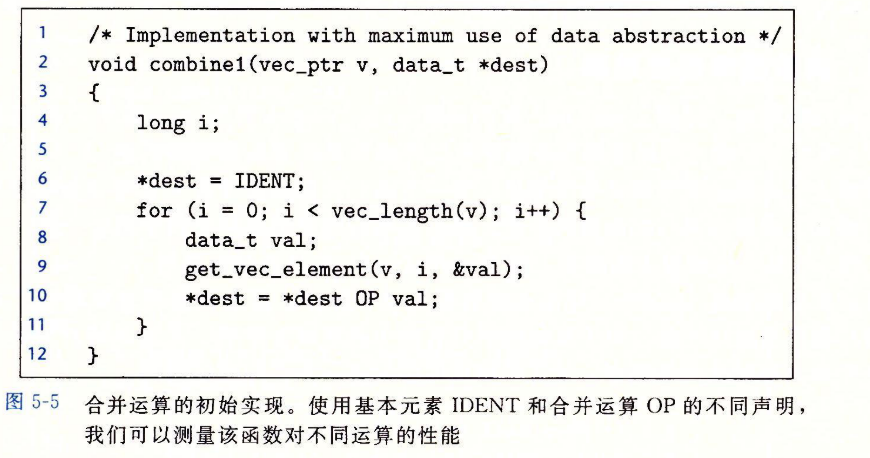

### 消除循环低效率

代码移动，执行多次但是不改变计算结果的移动外面

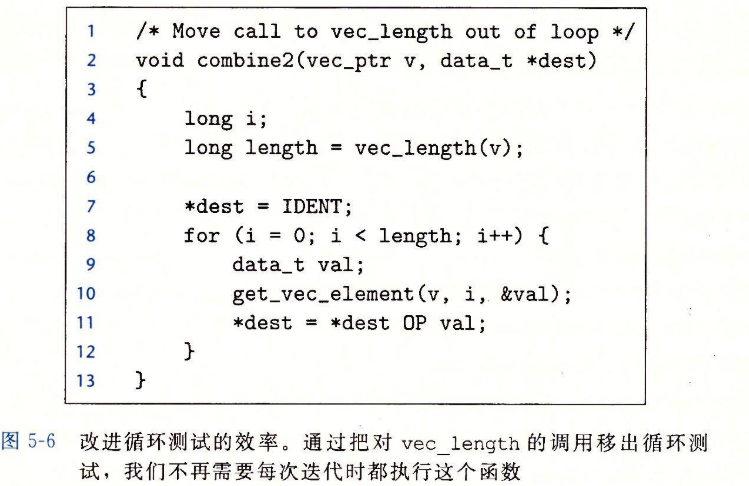

### 减少过程调用（减少函数调用）

- 减少不必要的内存引用：比如多次访问一个存在指针的数，用一个局部变量代替，最后赋值替代。但是要注意这种可能由于内存别名使用导致程序原本行为改变

  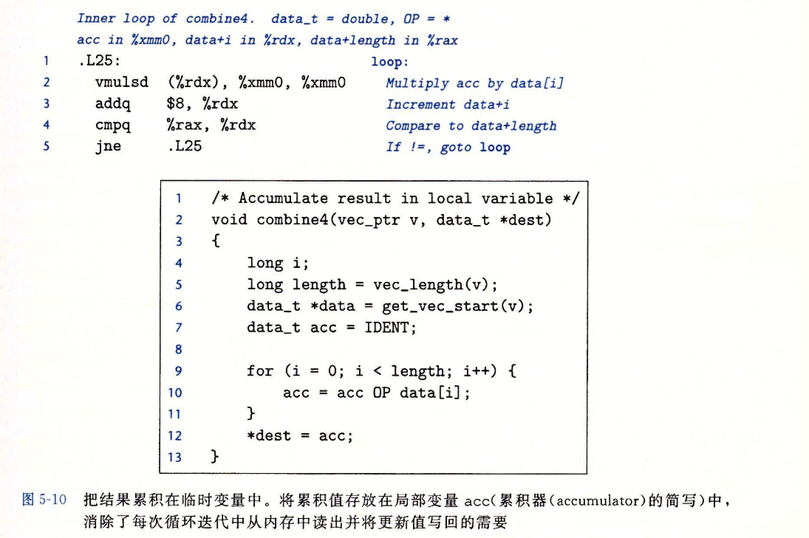

### 减少不必要内存引用

## 理解现代处理器

- 指令级并行

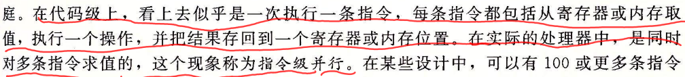

- 延迟界限和吞吐量界限

  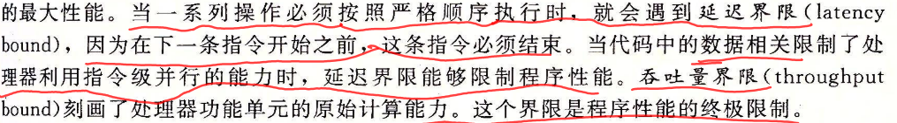

### 整体操作

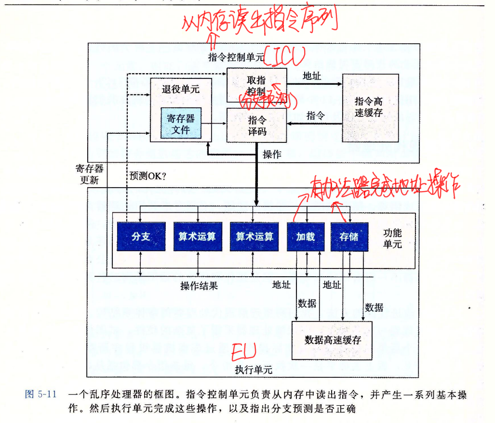

现代处理器采用分支预测技术，处理器猜测分支，预测目标地址，使用投机执行，结果会确定分支正确后更新。EU每周期会完成多个操作。

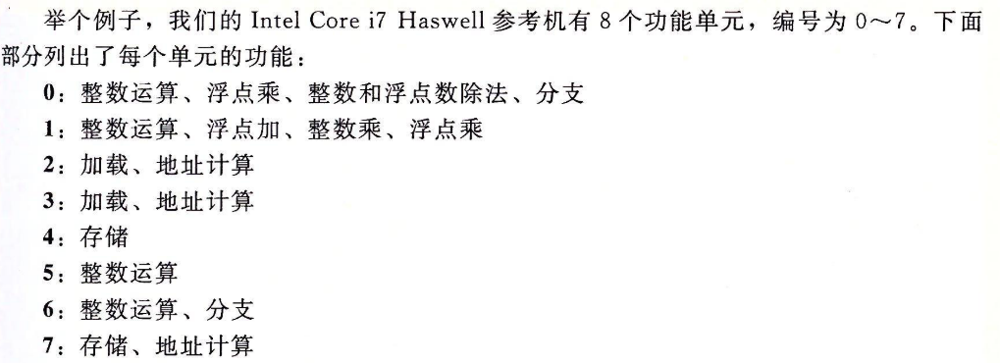

退役单元记录正在进行得到处理，确保遵寻机器级程序顺序语义。退役单元控制寄存器更新。如果预测正确，指令退役，否则指令清空。对寄存器的更新只会在指令退役才发生。

- 寄存器重命名机制

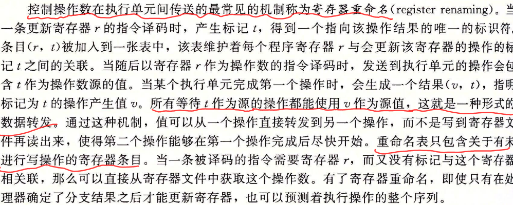

### 功能单元性能

发射时间为1的功能单元称为完全流水线化的。

最大吞吐量：发射时间的倒数

对于容量为C,发射时间为I的操作，处理器可获得的吞吐量为每时钟周期C/I个操作。

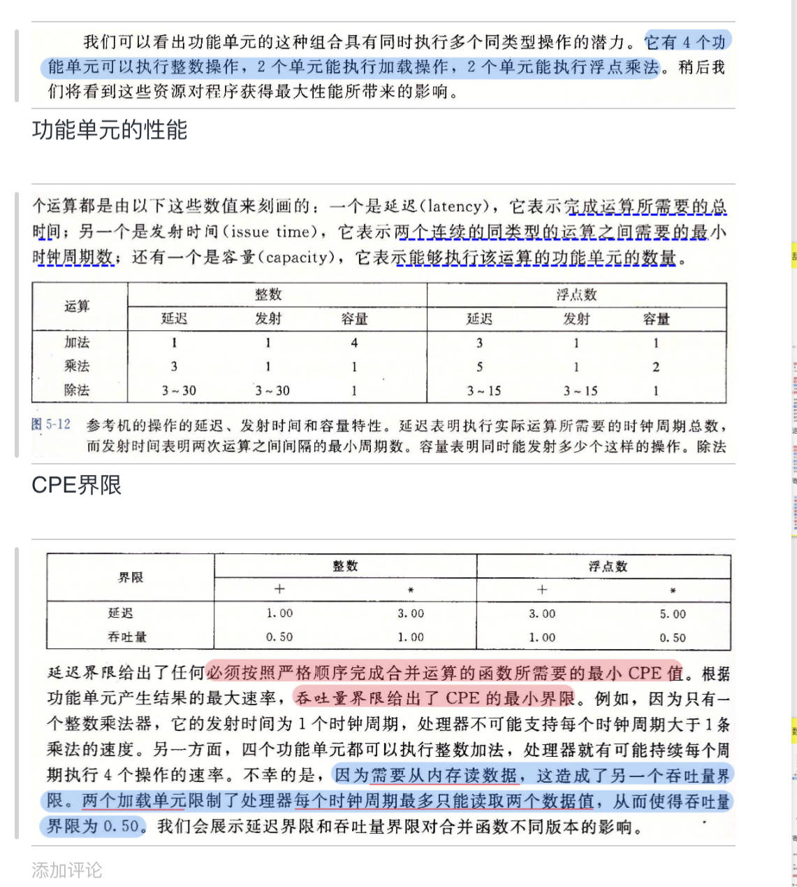

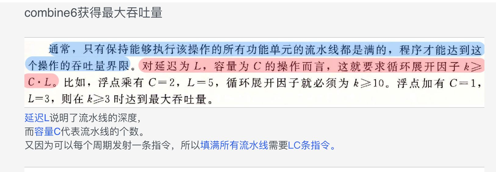

## 循环展开

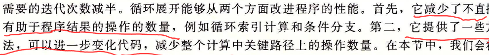

编译器可以循环展开

## 提高并行性

- 利用累计变量多个，注意整数数据类型是可以交换和结合的，但是浮点类型乘法，加法是不能结合的。大多数编译器不会尝试对浮点数代码进行这种变换，因为无法判断风险。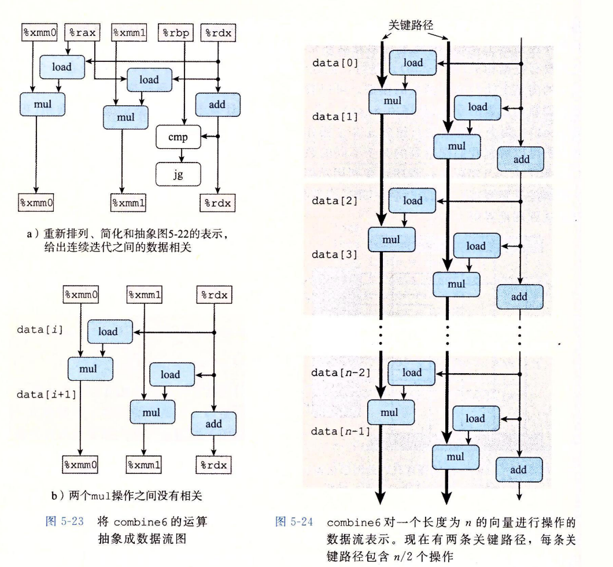
- 重新结合变换，使得程序的数据相关链减少。

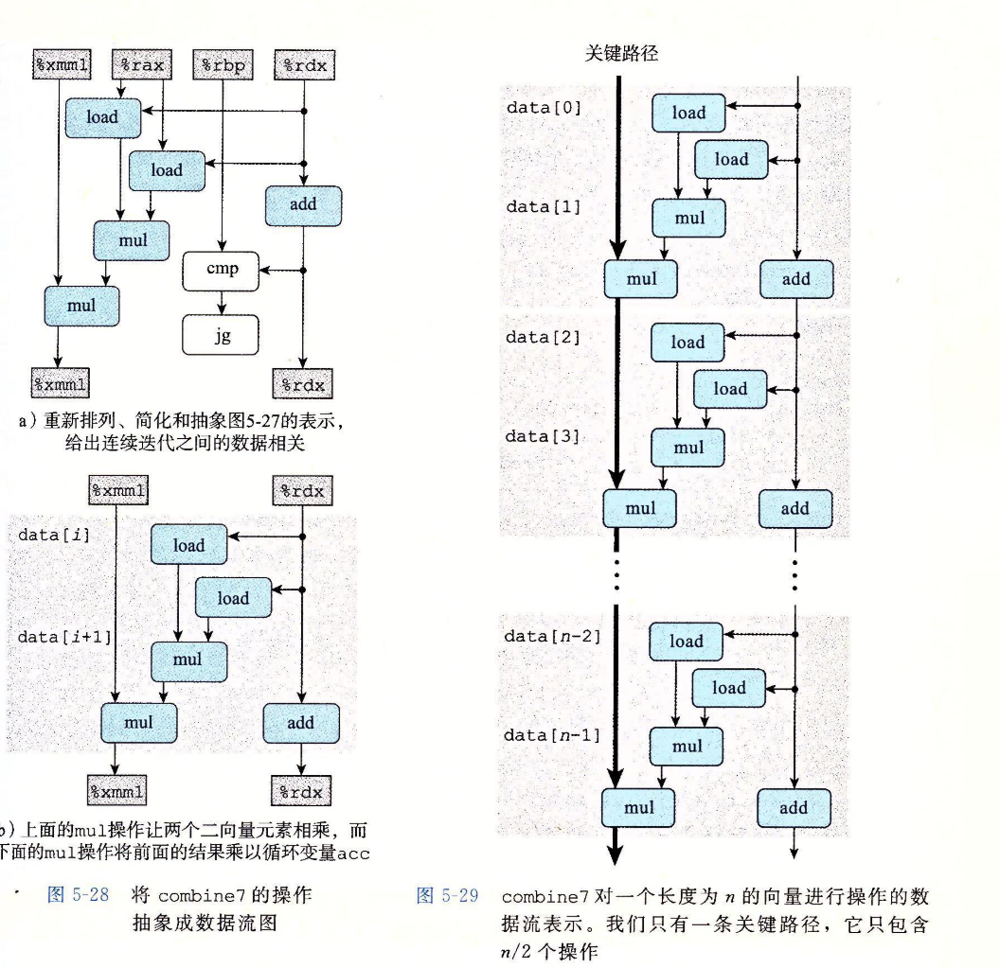

## 限制因素

- 寄存器溢出
- 分支预测和预测错误处罚

- 书写适合条件传送代码，利用三元式代替条件

## 了解内存性能

- 写读相关

## 未解决问题

数据相关的CPI上下界问题