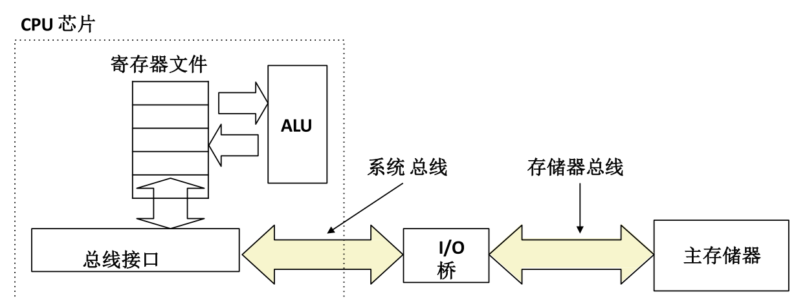
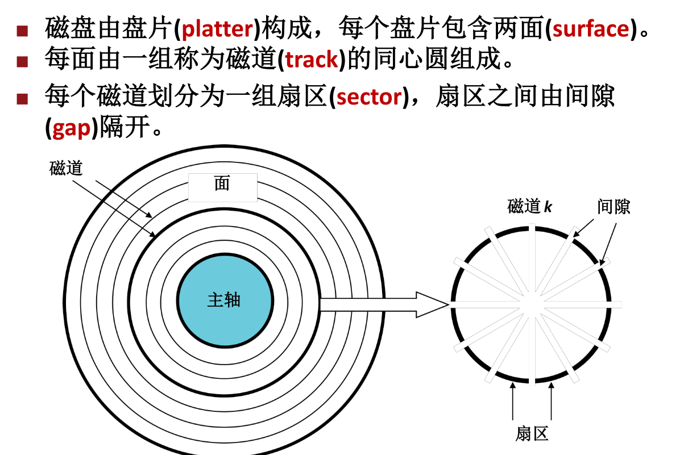
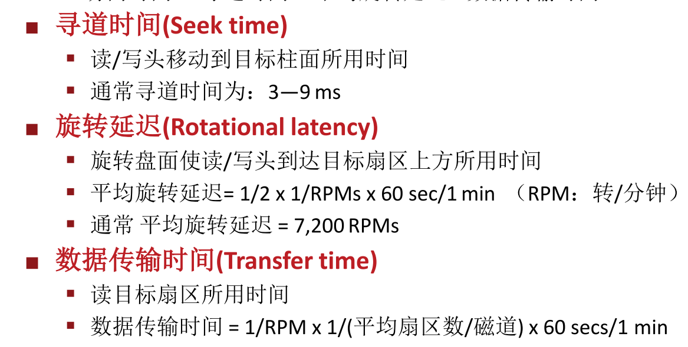
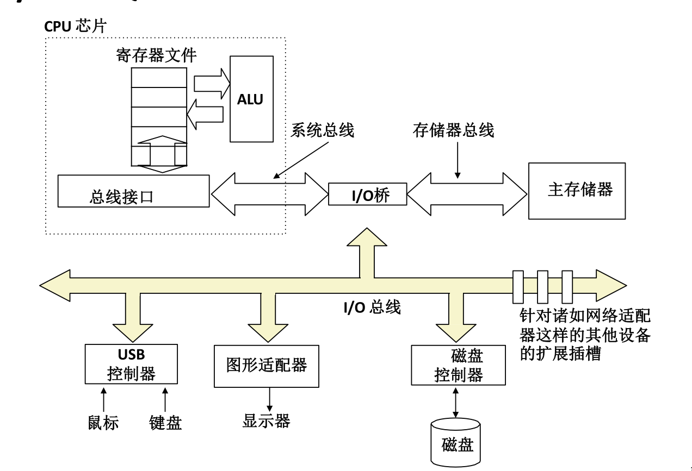
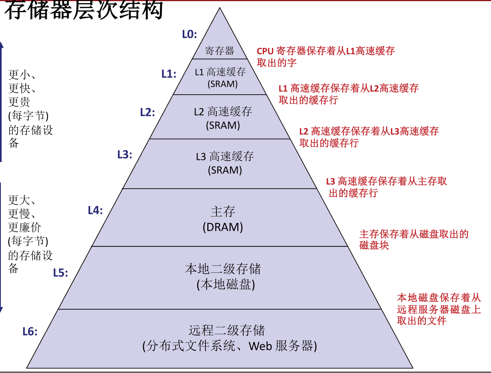
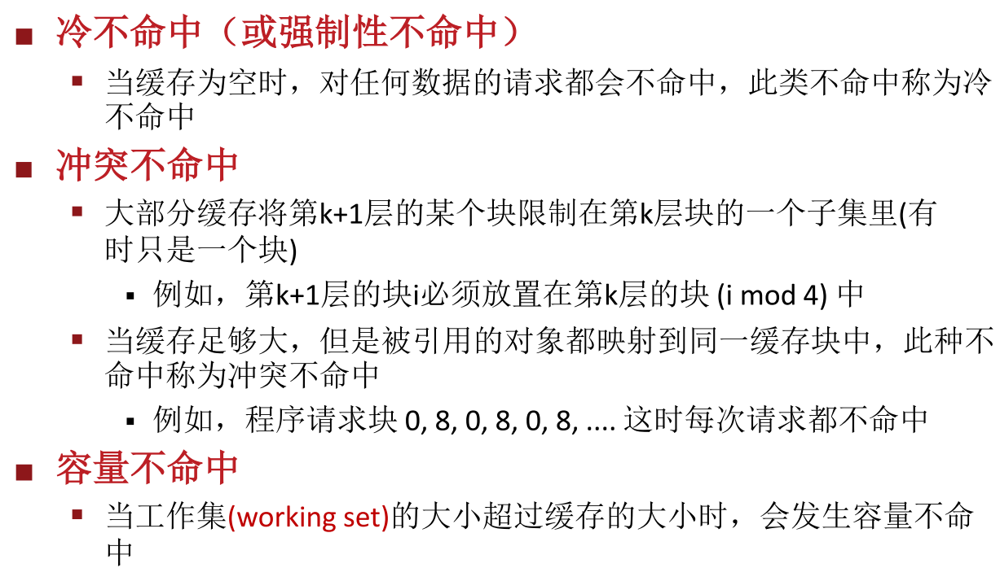
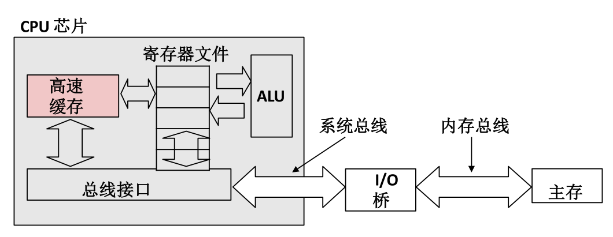
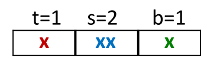
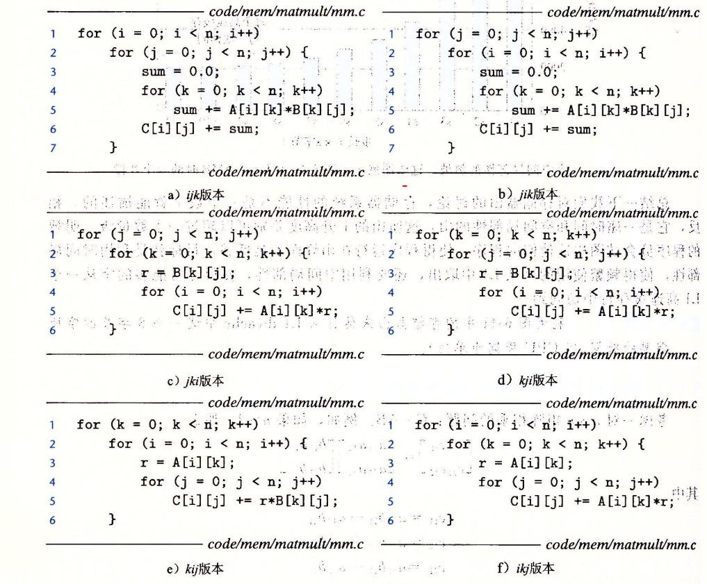

# 第六章_存储器结构

[TOC]

### 存储器类型

SRAM

DRAM

随机访问存储器RAM封装在芯片，基本存储单位是一个单元，每位存储一比特，多个RAM组成一个存储器，SRAM常用于高速缓存，DRAM常用于内存和帧缓冲区。

DRAM连接到内存控制器，每次传送w到或者出。行地址和列地址公用DRAM地址引脚

CPU使用内存映射IO技术向IO设备发送命令，在这类系统，地址空间有一块地址专门与IO设备同学，称为IO端口，设备连接到总线，和一个或多个端口关联

#### 固态硬盘

读比写快，随机读比顺序读慢

### 连接CPU和存储器的典型总线结构

存储器读事务，以movq A ,%rax举例

1. CPU将地址A放到总线上。
2. 主存储器从总线上读地址A，取出字x, 然后将x放到总线上。
3. CPU 从总线上读入字x, 并将其放入寄存器%rax

写事务 movq %raw,A

1. CPU 将地址A放到总线上，主存储器读地址A并等待数 据到来
2. CPU 将rax内容字y放到总线上
3. 主存储器从总线上读入字y，并将其存入地址A中

## 磁盘结构

同一半径上的所有磁道组成一个柱面。

磁盘容量决定因素 记录密度，磁道密度，面密度（前两者乘积）。

磁盘访问时间：寻道时间+平均旋转延迟+数据传输时间

磁盘控制器将逻辑块号转换为一个三元组(盘面, 磁道,扇区)，根据此信息可定位。

读：

CPU通过将命令、逻辑块号和目的内存地址写到与磁盘相关联的内存映射地址(port)，发起一个磁盘读 操作，然后执行到主存的DMA传送，最后DMA通过中断方式告知CPU.

## 局部性

### 时间局部性

当前被访问的信息近期很可能 还会被再次访问

### 空间局部性

在最近的将来将用到的信息很可能与 现在正在使用的信息在空间地址上是临近的

## 存储器层次结构

原理：局部性

## 高速缓存

一种更小、速度更快的存储设备。作为 更大、更慢存储设备的缓存区

### 缓存不命中类型

### 高速缓存存储器典型结构

## 几种相连

### 直接映射

每组只有一行，地址结构如下

### 组相联

和上面相同，只是这里的E，也就是一块内有多个行

### 全相联

这里S=1

路数是E的数目，$C=S*E*B$,S是组数，B是一块大小。

## 数据写回

>写直达 立即写入存储器
>
>写回 推迟写入内存直到行要替换，需要修改位
>
>写分配  加载到内存，更新此缓存行
>
>非写分配 直接写到主存，不写缓存
>
>通常
>
>直写+ 非写分配 
>
> 写回+写分配

## 编写高速缓存友好代码

> CPU寄存器由编译器管理 TLB由MMU管理，虚拟内存由硬件+OS

