# 第七章_链接

[TOC]

https://blog.csdn.net/qq_41899255/article/details/84791865  程序的生命流程

## 编译器驱动程序

静态链接过程

gcc -0g -o prog main.c sum.c

main.c通过CPP（c语言预处理器）变为main.i，在通过c编译器ccl翻译为main.s的Ascii汇编文件再通过as汇编器形成main.o可重定位目标文件。同样生成sum.o最后运行ld连接器程序，将文件组合，创建可执行目标文件

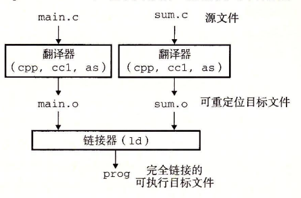

linux的shell调用操作系统加载器函数，将可执行文件的prog代码和数据复制到内存，然后控制转移到此程序开头。

## 静态链接

为构造可执行目标文件，链接器必须完成两个任务

### 符号解析

目标文件定义和引用符号，每个符号对应一个函数，一个全局变量或者一个静态变量。符号解析将符号引用和符号定义关联

### 重定位

编译器和汇编器生成从0地址开始的代码和数据节。链接器通过把每个符号定义和内存位置关联而重定位，然后修改引用，指向内存。链接器使用汇编器产生的重定位条件，不加判别的执行重定位

## 目标文件

编译可以发生在编译时，由静态连接器完成，也可以发生在加载运行，由动态连接器完成。


## 可重定位目标文件

ELF （可执行可连接格式）典型可重定位目标文件格式

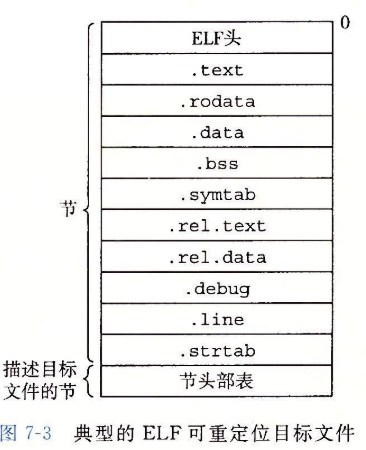

- .text存放代码

- .rodata 只读数据，如printf格式串和开关语句跳转表 ,*常量是const,以及enum定义的常变量，常数不是常量*
- .data  **已初始化的全局变量和静态C变量**，局部C变量保存至栈,不在.data,也不再.bss
- .bss **未初始化的全局和静态c变量，以及所有被初始化为0的全局或者静态变量**，在目标文件不占实际空间，只是一个占位符。运行时内存分配。
- symtab 符号表，用于存放程序定义和引用的函数和全局变量信息。不包含局部变量条目
- .rel.text  通常省略，用于重定位
- .rel.data 被模块引用或者定义的所有全局变量的重定位信息
- .debug存放的是局部变量定义和类型定义。


## 符号和符号表


.symtab不包含本地费劲太程序变量符号，此类符号一般存放在栈。定义为C static的本地过程变量存放在.data或者.bss，并在符号表创建一个唯一名词的本地链接器符号

> 符号分为外部符号，全局符号，局部符号
>
> 外部符号是在其他模块定义，本模块引用的全局变量和函数 普通函数，以及使用extern声明的变量
>
> 全局符号，本模块定义并引用的非静态的C函数和全局变量
>
> 局部符号：**带static属性的C函数和全局变量，本模块任意位置可见，但是无法被其他模块引用，局部变量不是符号**

符号表由**汇编器构造**,使用编译器输出到汇编语言的.s文件中符号。.symtab节包含ELF符号表，符号表包含一个条目的数组，格式：

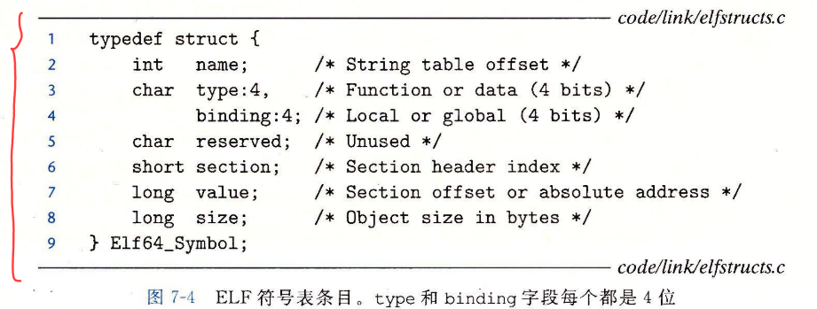

每个符号都被分配到目标文件某个节，section表示，是一个索引。有三个特殊伪节，在节头部表没有条目。

- UNDEF 在本目标模块引用，其他地方定义的符号 UND

- ABS 不该被重定位的符号

- COMMOM，这里value给出对齐要求，size给出最小大小,**只有重定位目标文件才有这些伪节**，重定位目标文件无

  

## 符号解析

### 解析多重定义全局符号

静态局部变量也有本地链接器符号.


规则：


注意如果类型不同，比如double和int同名全局，但是一个强，可能会出现覆盖变量问题。

编译时，，编译器向汇编器输出每个全局符号，或强或弱，汇编器把这个信息隐含编码在可重定位文件的符号表内。

通过$-Gcc-fno-common/-Werror$选择可以显示提醒


### 与静态库链接


静态库使得相关函数可以编译为独立目标模块，封装成一个单独静态库文件。


Linux静态库以存档的特殊文件格式存放在磁盘，是一组连接的可重定位目标文件集合。后缀a标识。


创建静态库：


链接执行：


-static 构建完全链接可执行文件 -L.告知当前目录查找库


### 利用静态库解析引用

符号解析阶段，链接器从左到右按照编译器驱动程序命令行出现顺序扫描重定位目标文件和存档文件。编译器维护可重定位目标文件集合E,一个未解析的符号集合U,以及一个在前面输入文件中一定义的符号集合U


> 对于不独立，需要重复排序引用。如果满足依赖，可以重复库
>
> 


## 重定位

- 重定位节和符号定义

- 重定义符号引用

  

### 重定位条目

汇编器遇到对最终位置未知的目标引用，生成一个重定位条目，告诉链接器生成可执行文件如何修改。代码重定位放在.rel.text,数据放在.rel.data


ELF格式：

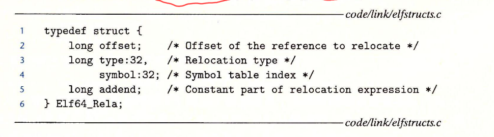

一两种基本重定位类型为例

- R_X86_64_PC32 相对引用
- R_X86_64_32 重定位绝对引用

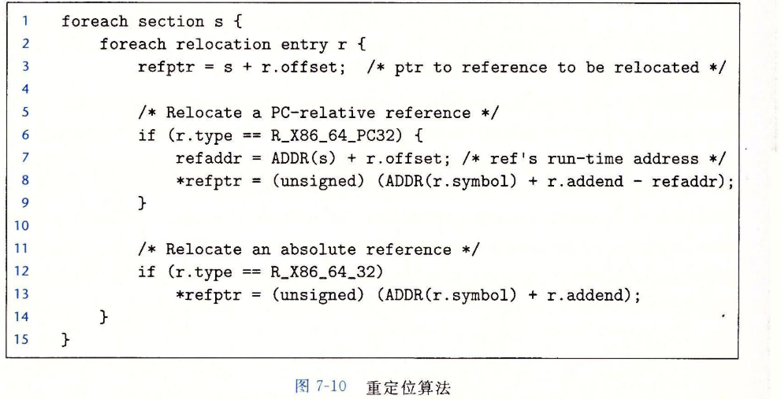

计算参考p481

Ndx为1表示代码段，为3表为数据段。COM是定义但未初始化的全局变量，而在其他文件定义的函数在此文件声明，则属于UND


## 可执行目标文件

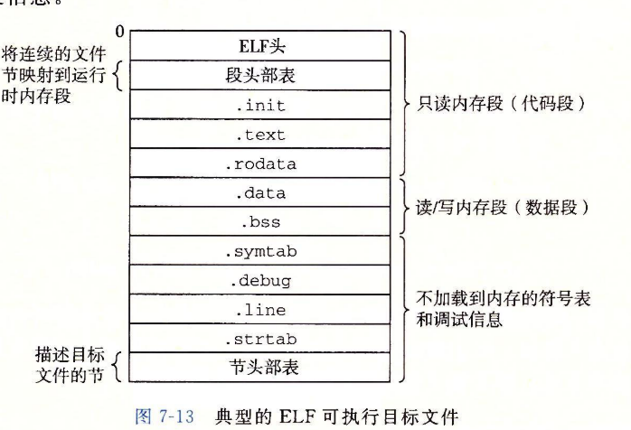

ELF头包括程序入口点，也就是程序允许执行的第一条指令地址。.init定义了一个小函数_init，程序初始化代码使用。**段头部表是描述可执行文件连续片映射到连续内存段。**

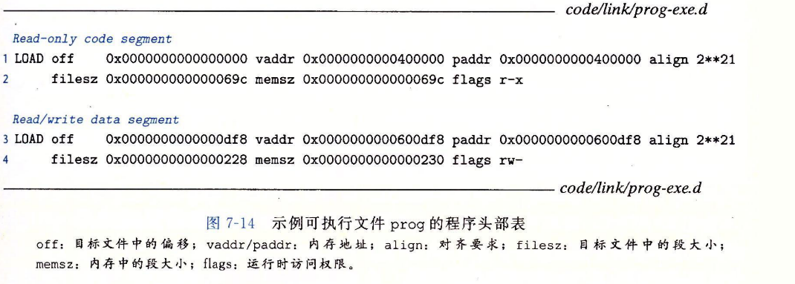

头部表满足

$vaddr\  mod\ align = off\ mod \ align $

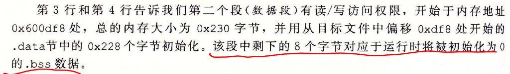


## 加载可执行文件

程序调用exceve寒素调用加载器，加载器允许是创建内存映像，在程序头部表的引导下，加载器将可执行文件的片复制到代码段和数据段。然后加载器跳转到程序入口点_start函数地址，在ctrl.o定义，_start函数调用系统启动函数-libc_start_main，定义libc.so初始化环境，调用用户层main

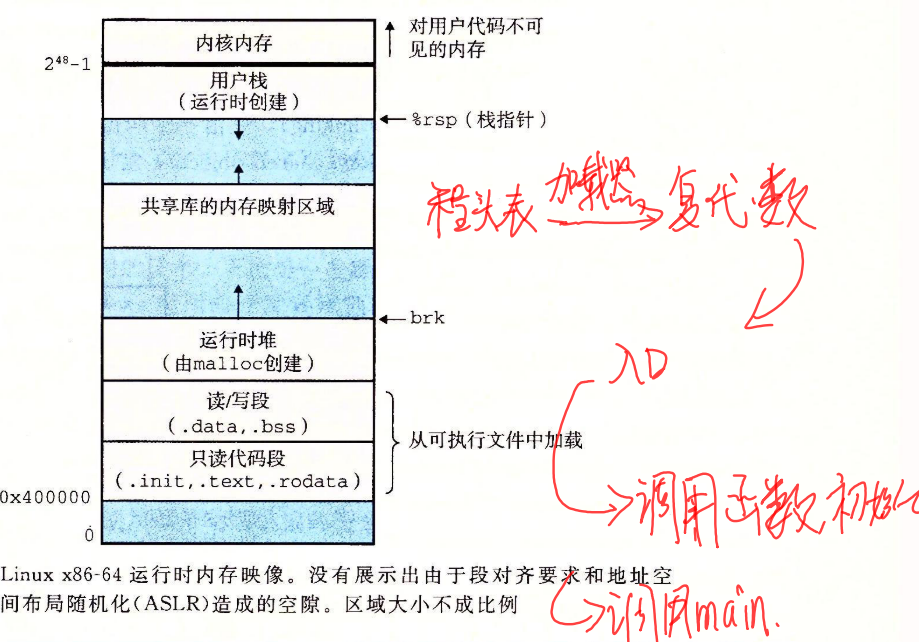


## 动态链接共享库


所用引动该库的可执行目标文件共享.so代码数据，不是复制嵌入。

生成共享库


链接

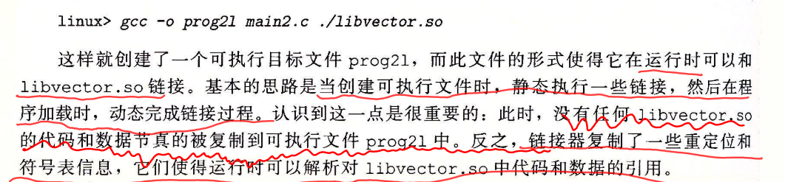

加载文件，prog21有.interp节，包含动态链接器路径名，动态链接器本身就是一个共享目标，加载器加载运行这个动态链接器。然后执行


 

### 应用程序加载链接

接口

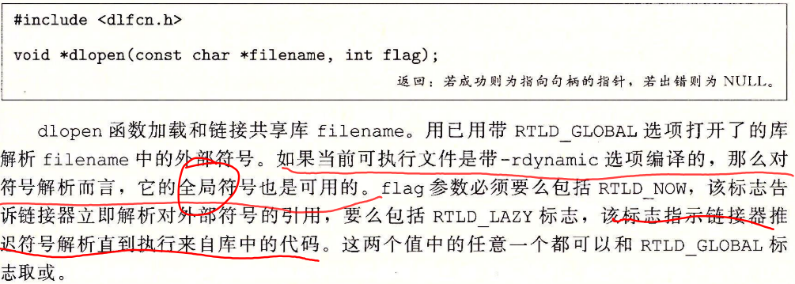


输入时一个共享库句柄，和symbol名字，返回符号地址

```c
int dlclose(void *handle)
```

没有其他共享库使用，dlclose就自动卸载共享库

>共享库（动态连接库）是一个.so 的目标模块（elf 文件），在运行或加载时，由动态链接器程序加载到任意的内存地址，并和一个和内存中的程序（如当前可执行目标文件）动态完全连接为一个可执行程序。使用它可节省内存与硬盘空间，方便软件的更新升级。如标准 C 库 libc.so 。
>
>- 加载时动态链接：应用程序第一次加载和运行时，通过 ld-linux.so 动态链接器重定位动态库的代码和数据到某个内存段，再重定位当前应用程序中对共享库定义的符号的引用，然后将控制传递给应用程序（此后共享库位置固定了并不变）。
>- 运行时动态链接：在程序执行过程中，通过 dlopen/dlsym 函数加载和连接共享库，实现符号重定位，通过 dlclose 卸载动态库
>
>静态库：编译时将所有相关的目标模块打包成为一个单独的文件用作链接器的输入，这个文件称为静态库。
>
>- 使用时，通过把相关函数编译为独立模块，然后封装成一个单独的静态库文件，应用程序可以通过在命令行上指定单独的文件名来使用这些在库中定义的函数，链接器只需复制被程序引用的目标模块，减少了可执行文件在磁盘和内存中的大小；同时，应用程序员只需包含较少的库文件的名字。静态库以存档方式存在磁盘

## 位置无关代码


编译器生成

1.PIC数据引用

在数据段开始位置创建GOT,每个被目标模块引用的全局数据目标都有一个八字节条目，加载，动态编译器重定位GOT每个条目。

2.PIC函数调用

初始时，每个GOT条目都指向对应PLT条目的第二条指令,位置无关代码最后重定位函数地址结果是PLT的Jmp地址,然后跳转到对位置执行。未重定位前，重定位位置是当前地址和下指令的地址差，也就是修正（可参考上交题）


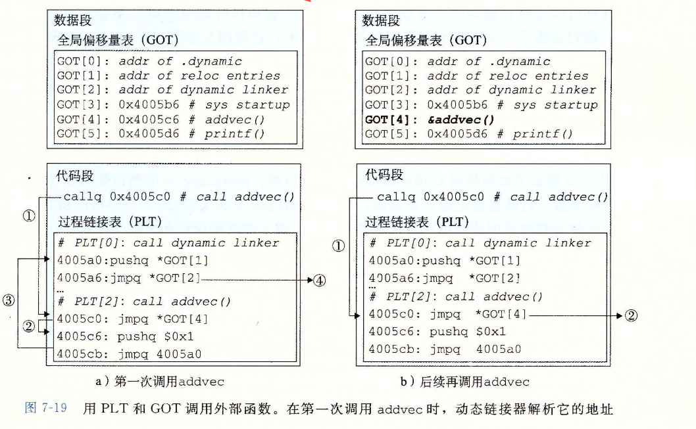


## 库打桩

截获对共享库调用，使用自己代码

```shell
gcc -DCOMPLIETIME -c mymalloc.c
gcc -I. -o intc int.c mymalloc.o //I.参数打桩

//链接打桩
gcc -DLINKTIME -c mymalloc.c
gcc -c int.c
gcc -Wl,--wrap,malloc -Wl,--wrap,free -o intl int.o mymalloc.o

//运行打桩
gcc -DRUNTIME -shared -fpic -o mymalloc.so mymalloc.c -ldl
gcc -o intr int.c
LD_PRELOAD="./mymalloc.so" ./intr
```

