# 异常流

[TOC]

## 控制流

处理器从加电到断电，处理器只是简单读取执行一个指令序列，这个指令序列就是处理器的控制流

### 改变控制流

 跳转，分支调用，返回，可以对（由程序变量表示的）程序状态变化作出反应

但是对于系统状态变化难以反映，如除零错误。现代系统通过使控制流发生突变对这些情况做出反 应，称为“异常控制流

## 异常控制流ECF

发生在计算机系统的各层次。是操作系统实现IO、进程和虚拟内存的基本机制，应用程序通过使用陷阱或者系统调用的ECF方式向操作系统请求服务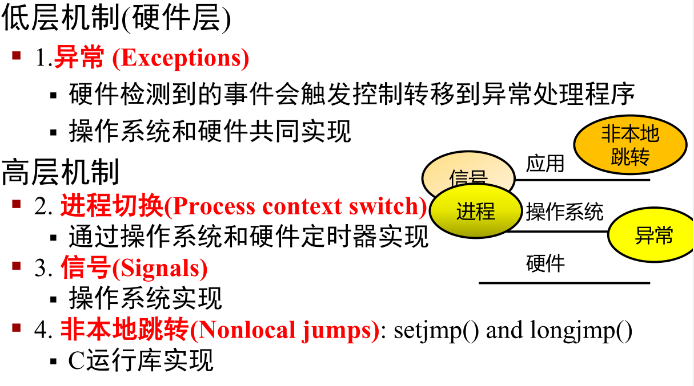

## 异常

异常时控制流突变，响应处理器状态的某些变化，事件可能和当前指令执行直接相关也可能无关如IO完成，系统定时器产生信号。异常是否发生和当前指令是否执行无必然联系。

异常处理程序处理完成后，根据类型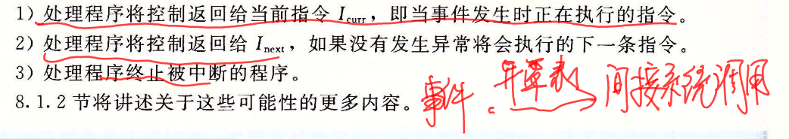

异常是指为响应某个事件将控制权转移到操作系统内核中的情况，有异常表和异常偏移寄存器二者定位，从而执行相应的异常处理程序。最后结果 控制返回给当前指令，返还给下一条指令，终止被中断程序。异常处理程序均工作在内核模式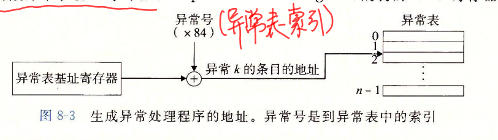

异常类别

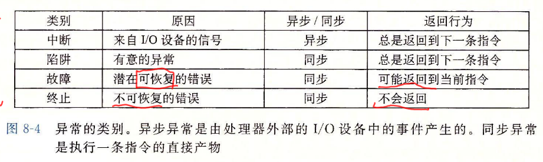

异常号:

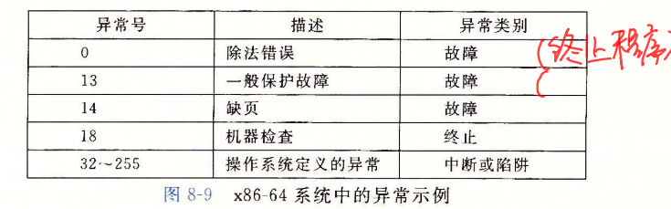

### 异步异常

#### 中断

由处理器外部IO设备引起，处理器的中断引脚电位变化，中断处理程序最终返回到下一条指令处 

例子 时钟中断，Ctrl-c 网络数据包

### 同步异常/故障指令

#### 陷阱

有意的，执行指令的结果，陷阱处理程序将控制返回给下一条指令。

例子：系统调用，用户程序和内核之间的接口。

#### 故障

不是有意，可能被修复，处理程序要么重新执行已修复的指令，要么终止。

例子：缺页（可恢复），一般保护故障（不可恢复，引用了一个未定义的虚存区域，一般称为段故障），浮点异常（除0）

linux系统调用每个都有调用号，对应一个到内核跳转表大的偏移量，存放在通用寄存器rax，而不是栈传递。从系统调用返回时rcx和r11会被破坏

#### 终止

非故意，不可恢复致命错误造成，最后终止当前程序。处理程序将控制返还给一个abort例程。

如：非法指令（SIGSEGV），奇偶校验错误，机器检查

#### Linux故障和终止

除法错误 应用尝试除0或者结构对于目标操作数太大了，通常报错为浮点异常。

一般保护故障，定义了未定义的虚拟内存区域，或者程序尝试写一个只读文本段。又称段故障。不会恢复

缺页（异常14），重新执行产生故障指令。

机器检查（18） 在倒置故障的指令执行中检测致命的硬件错误。

异常号和系统调用号不同

#### Linux系统调用

每个系统调用对于一个唯一整数号，对应一个内核跳转表的偏移量。所有到Linux的系统调用参数通过寄存器传送，而不是栈。从系统返回是寄存器%rcx，%r11会被破坏。注意寄存器顺序

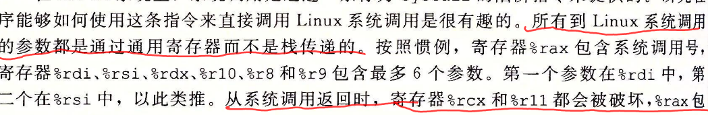

> 栈帧参数顺序：$rdi,rsi,rdx,rcx,r8,r9$
>
> 被调用者保存寄存器 $rbx,rbp,r11-r15$
>
> 调用者保存寄存器$除了rsp和上面$
>
> 系统调用参数：$rax包含调用号，rdi,rsi,rdx,r10,r8,r9最多包含6个参数，系统调用返回rcx,r11都被破坏，rax包含返回值$
>
> 系统调用和库函数区别：
>
> 1. 库函数是语言或者程序部分，系统调用是内核提供给应用程序接口，属于系统部分
> 2. 库函数在用户地址空间执行，系统调用在内核地址空间执行，库函数开销小，系统调用大
> 3. 库函数有缓冲，系统调用无缓冲
> 4. 系统调用依赖平台，库函数不依赖
>
> 

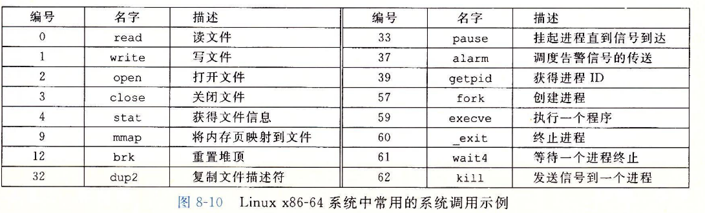

## 进程

### 上下文

进程执行时CPU中所有寄存器值，进程状态，堆栈内容称为进程上下文，当内核切换进程，就需要保存当前进程上下文，再次执行恢复。

1. 上下文=进程控制块（包含了很多信息，比如:此进程是否在内核态，内核堆栈的指针）+进程代码+进程堆栈（如果在用户状态就是用户堆栈，如果在内核态就是用户堆栈+内核堆栈）+cpu现场（即当前cpu的各个寄存器的状态）+连接在cpu上的与该进程相关的外部设备+环境变量（其实本身就包含在进程控制块里面）+页表+某个具体版本的内核

异常时允许操作系统内核提供进程概念的基本构造快。发生上下文切换的情况可以是执行系统调用，中断。

两个关键抽象：

- 逻辑控制流 每个程序似乎独立占用CPU,通过OS内核上下文切换机制

- 私有地址空间：每个程序似乎独占使用内存，OS虚拟内存机制

进程地址空间

**处理器在跳转搭配异常处理程序前，需要现根据异常类型将不同返回地址压栈，将处理器状态也压栈，由于异常处理程序运行在内核模式下，故压到内核栈。** 内核有自己的代码段，数据段，堆栈段。

常见的系统调用，调用存放在标准C库，底层调用通过syscall完成。调用号，返回都放在%rax。

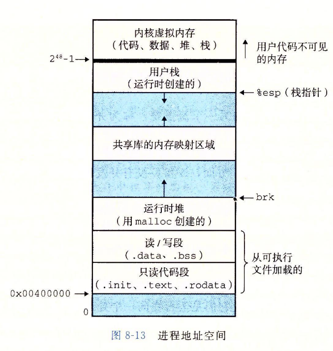

### 并发

每个程序是个逻辑控制流，如果两个逻辑时间有重叠，则称为并发，否则顺序。

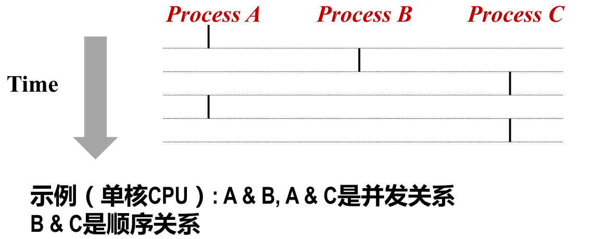

### 用户模式和内核模式

通过用某个控制寄存器的一个模式位提供此功能。此寄存器描述了进程当前享有特权。

## 进程控制

### 系统调用错误处理

当Linux系统级函数遇到错误时，通常返回-1并设置 全局整数变量errno

规定：必须检查每个系统级函数返回状态。只有少数返回为空的函数

进程的状态可分为

1.运行

2.停止 收到SIGSTOP/SIGTSTP/SIGTTIN/SIGTTOU，收到SIGCOUT再次运行

3.终止 进程会因为三种原因终止: 

1. 收到一个信号，该信号的默认行为是终止进程 
2. 从主程序返回 
3. 调用exit函数，正常返回状态0，以status参数退出状态终止进程

### 进程图刻画fork

父进程和子进程有相同的地址空间，共享相同的打开文件。

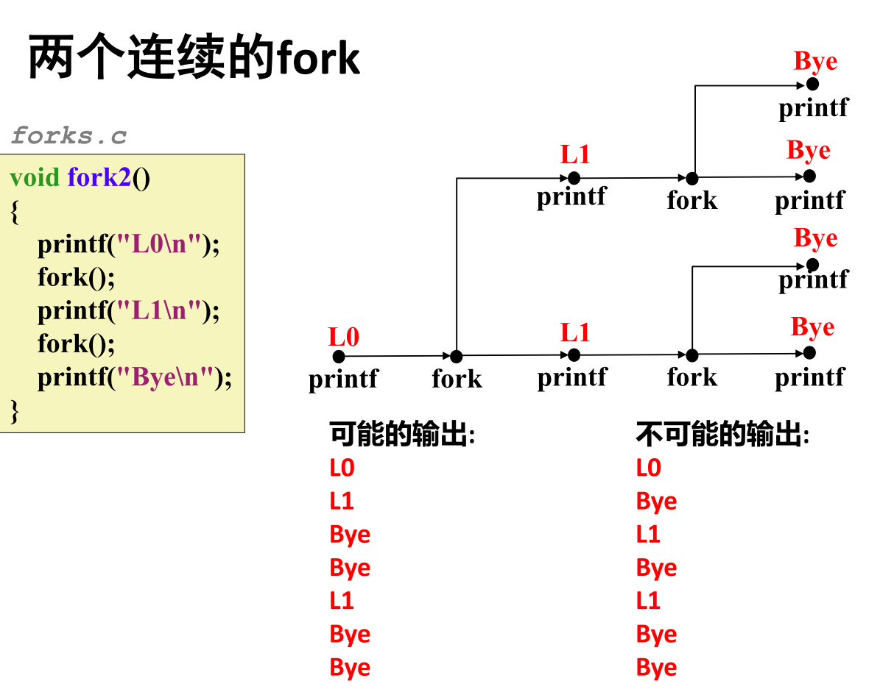

是图的拓扑排序

### execve

除非出现错误，否则此函数加载运行可执行目标文件后不返回，在当前进程上下文加载运行新程序，**覆盖当前进程的地址空间，并没有创建新进程**。新加载的程序PID不变，而且继承调用了execve时已打开的文件。先押入envp最终指向的所有字节串，再压入argv字符串，然后押入envp[]和argv[]指针数组。

​	shell封装的指令分为内建指令和外部指令，不是直接的系统调用指令。如果这是个外部指令，如pwd,就用类似fork+execve加载某种系统指令的方式实现，如果是内建指令，就对应上面代码的builtin_command函数中定义的指令，只不过我们的程序中只有一个quit的内建指令罢了。内建指令直接由shell执行，不需要派生新进程。和我们代码中的builtin_command函数对应上了，里面直接做了系统调用，并没有用fork+execve加载到新的进程中运行。（书）

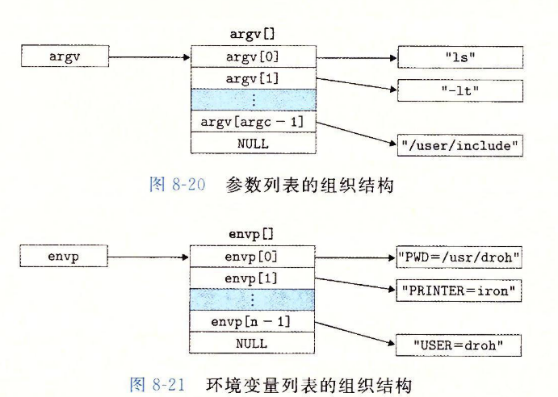

   shell外部指令对应的可执行文件一般在bin下，是外部指令，而cd则是shell的内建指令。

​		argv变量指向的是一个以null结尾的指针数组，每个指针都指向一个参数字符串。argv[0]是可执行目标文件的名字

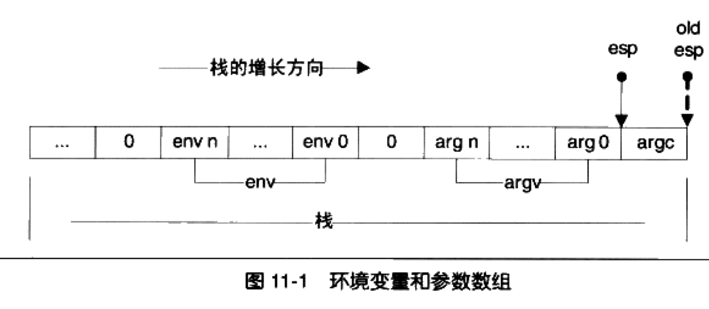

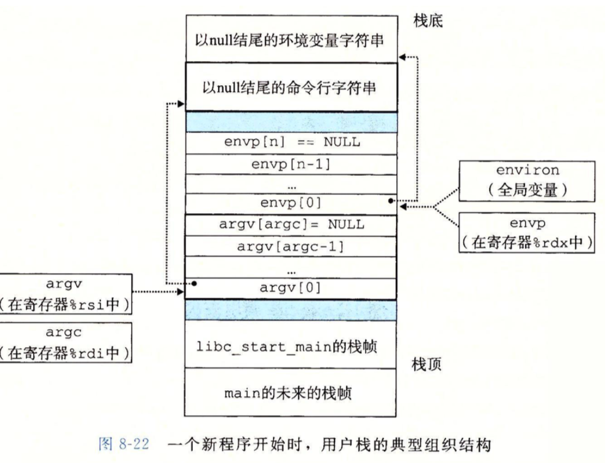

### 僵死进程

waitpid函数 

等待集合成员根据pid确定，option可以修改默认行为。默认是挂起调用进程，调用进程没有子进程，返回-1errono为ECHILD，若中断返回，返回-1，errno设置为EINTR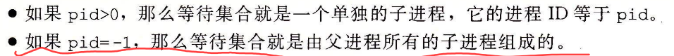

wait（int *child_status）均可让父进程回收子进程,根据参数状态决定检查方式

## 信号

> 信号和信号量完全不同，信号是对中断的软件模拟，告知用户进程发生了哪些异常。关于异常和中断，不同书对这些概念不同，一般分为普通中断和陷阱。对异常处理可以通过定义信号处理函数，或者终止，或者忽略

典型信号

发送信号：内核通过更新目的进程上下文中的某个状态，发送 （递送）一个信号给目的进程

- 发送信号
  - 进程组
  - 通过/bin/kill程序发送 /bin/kill 9（信号名） pid（pid为-，发送整个组）
  - 通过键盘,如ctrl-c（z 挂起）发送SIGINT 2（SIGTSTP）信号给前台进程组每个信号 进程除0，发送SIGFPE(8)，执行非法指令，发送SIGILL(4),非法内存引用SIGSEGV（11）.子进程终止或者停止，发送SIGCHLD(17)给父进程。进程可以通过发送SIGKILL(9)强制终止另外一个进程。
  - kill函数
  - alarm

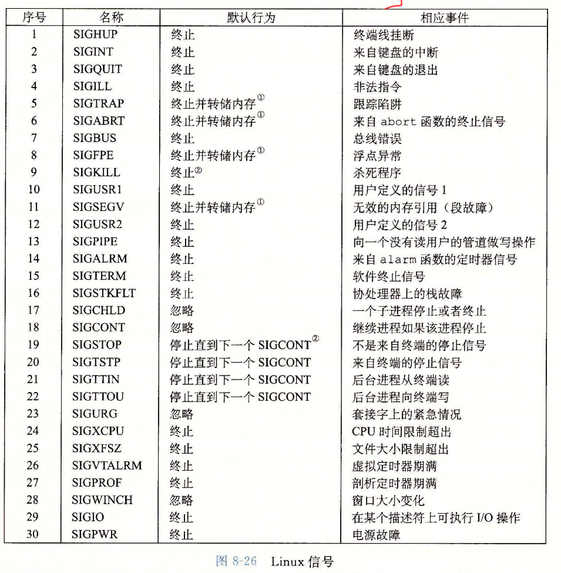

可能原因：1.内核检测到一个系统事件如除零错误(SIGFPE)或者子进程 终止(SIGCHLD)，2.一个进程调用了kill系统调用，显式地请求内核发送一 个信号到目的进程

接受信号：当目的进程被内核强迫以某种方式对信号的发送做出反应 时，它就接收了信号

反应的方式：忽略，终止，捕获

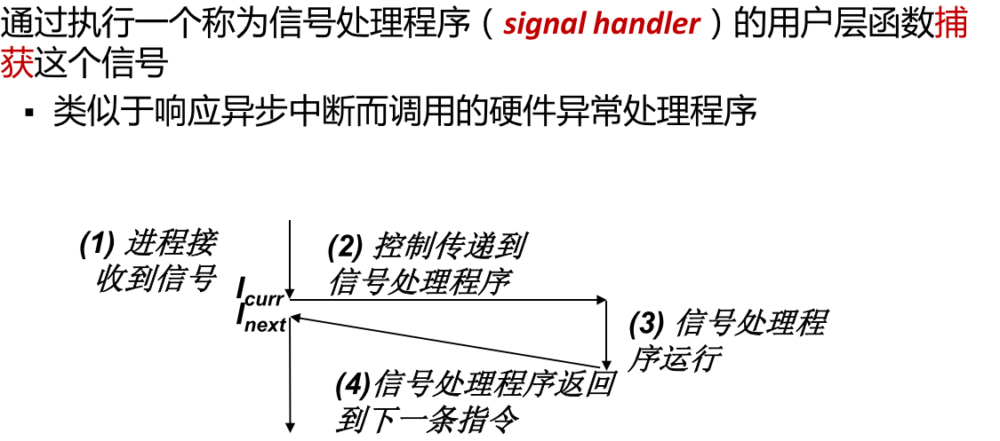

- 待处理信号：一个发出而没有被接收的信号叫做待处理信号
  - 任何时刻，一种类型至多只有一个待处理信号
  - 信号不会排队等待，如果进程已有类型为k的待处理信号，则接下来k被抛弃

- 阻塞信号：阻塞的信号仍可以被发送，但不会被接收，直到进程取消 对该信号的阻塞
- 一个待处理信号最多只能被接收一次

- 待处理位/阻塞位，有待处理位向量和阻塞位向量，可通过sigpromask设置

  

#### 信号默认行为

默认可以是忽略，终止，捕获通过signal设置处理函数

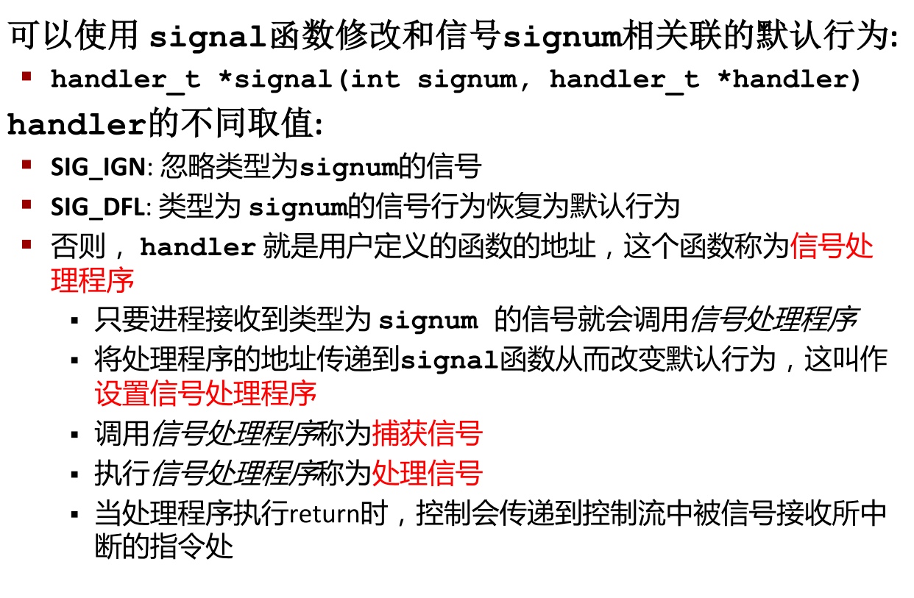

#### 阻塞和解除阻塞信号

内核默认阻塞与当前正在处理信号类型相同的待处理信号.如，一个SIGINT 信号处理程序不能被另一个SIGINT信号中断 （此时另一个SIGINT信号被阻塞）

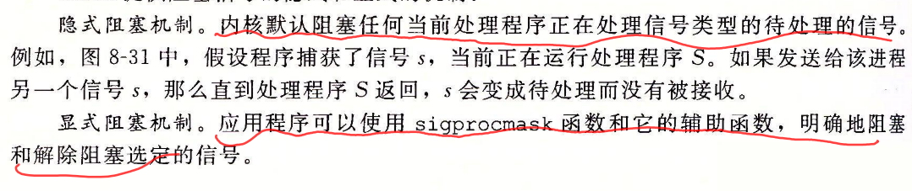

### 编写处理程序原则

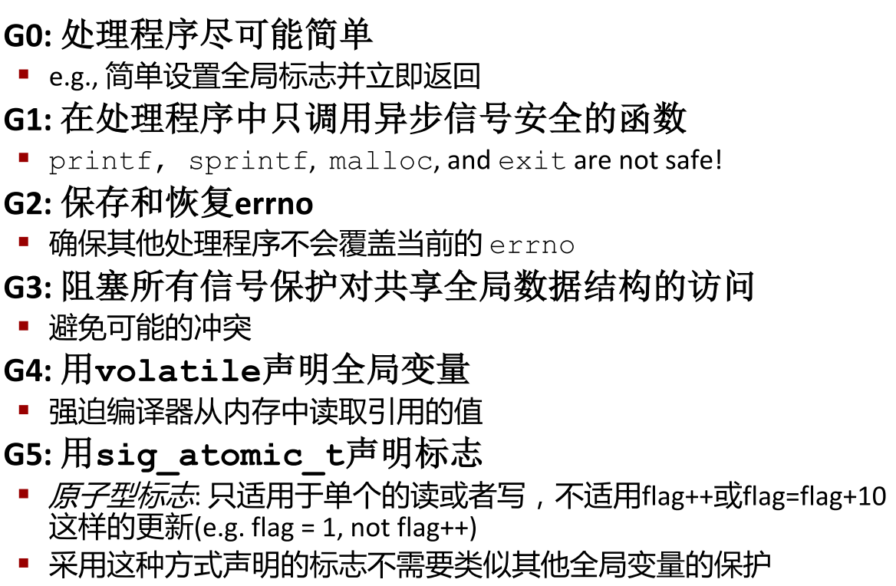

函数是异步信号安全的指函数要么是可重入的，要么不能被信号处理程序中断

信号处理时不排队的，pending位向量中每类型信息只有一位，如果两个类型k的信号发送给目的进程，而目的进程正执行k,那么第二个信号就被简单丢弃。

只要有一个进程终止，内核就会发送SIGCHLD给父进程。

### 非本地跳转

将控制直接从一个函数转移到另外一个函数。不需要通过正常调用返回长须。非本地跳转通过setjmp和longjmp实现。setjmp调用一次返回多次，longjmp调用一次，从不返回，**可以从深度嵌套的函数调用立即返回**

**setjmp函数在env缓冲区保存当前调用环境，供后面longjmp调用**。longjmp从env缓冲区恢复调用环境，触发一个从最近一次初始化内env的setjmp返回。然后setjmp返回，带有非零值。