# 虚拟内存

[TOC]

虚拟内存是使用时调入。

虚拟地址空间大小字长决定，物理地址空间大小总线决定。

虚拟内存提供了三个重要功能

- 在主存自动缓存最近使用的存放磁盘地址空间的内容 --有效使用主存
- 简化内存管理，进而简化了链接，共享数据，内存分配和程序加载 --进程使用统一线性地址空间，独立地址空间
- 虚拟内存通过在页表目设置保护位，实现内存保护。

虚拟内存被组织为一个存放在磁盘的N个连续字节大小单元。VM系统通过将虚拟页分割称为虚拟页VP,物理内存则为PP,二者大小相同。

页表中出现的每一个条目都是已分配的。虚拟页面集合分为三个不相交的子集

- 未分配，VM系统还未分配未创建，不占磁盘空间
- 缓存 当前缓存在内存中的已分配页
- 未缓存，已分配但是未缓存在物理页

主存采用DRAM,其不命中惩罚很大，尤其是访问第一个字节。DRAM总是使用写回而不是直写，且采用全相联。

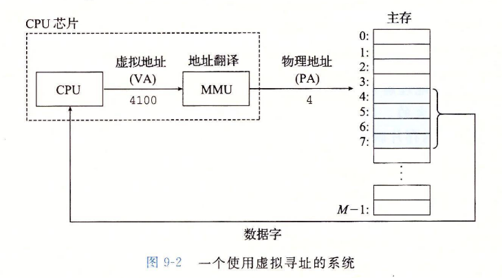

#### 再看链接加载

独立地址空间允许每个程序使用相似地址空间，代码，数据，堆使用相同的其实地址

Loading 加载 

- execve 为代码段和数据段分配虚拟页，并标记为无效（即未被缓存）

- 每个页面被初次引用时，虚拟 内存系统会按照需要自动地调 入数据页。

- 加载时信息不会从磁盘调入，而是是进行了映射

  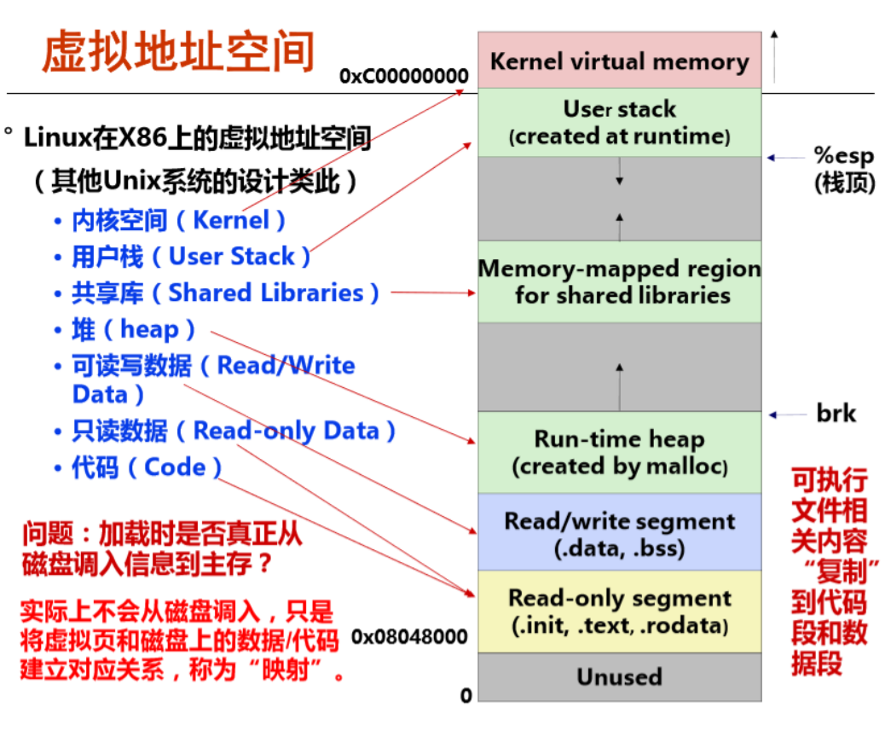

## 虚拟内存作为工具

- 缓存

  - 页分为三类
    - 未分配未缓存，没有任何数据和此关联，因此此页不占用磁盘空间
    - 缓存已分配
    - 未缓存已分配
  - Dram缓存使用的是全相联，而且缓存使用写回而不是直写
  - 页表
    - 每个进程都有自己的页表，将虚拟页转到物理页。
    - 缺页不命中时会选择牺牲页，若牺牲页被修改则写回到磁盘。然后修改表目，从磁盘复制对应页，更新页表。
    - 计算机使用的是按需页面调度。分配页面则是磁盘创建空间，并更新PTE,指向新页面。
    - 如果缺页时替换的页是修改过的，还需写回

  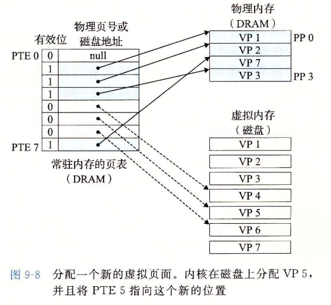

- 内存管理

  - VM简化了链接，加指、代码和数据共享以及应用程序内存分配
  - 简化链接，独立地址空间允许进程内存映像使用相同基本格式，无需在意代码和数据物理内存实际位置
  - 简化加载 。容易向内存加载可执行文件和共享对象文件  
  - 简化共享，独立地址空间向操作系统提供了一个管理用户进程和操作系统共享的一致机制。
  - 简化内存分配，虚拟内存向用户进程提供了一个简单分配各位内存机制。可以将连续的虚存页映射到不连续的物理页

  

- 内存保护，CPU生成地址，地址翻译硬件读取PTE，通过在PTE上添加额外信息控制对虚拟页访问，运行在内核的进程可以访问任何页面，但是用户进程只能访问SUP=0的页。一旦违反，触发段错误。

按序页面调度和独立虚拟地址空间。

## 虚拟内存地址翻译

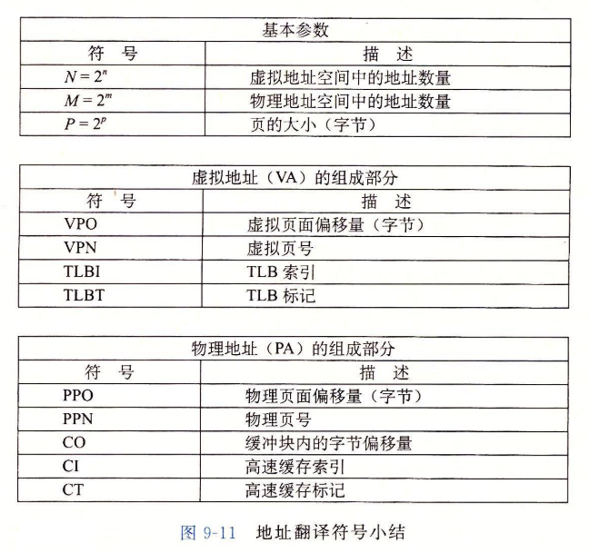

MMU通过VPN选择PTE，将物理页和虚拟地址VPO链接得到地址。

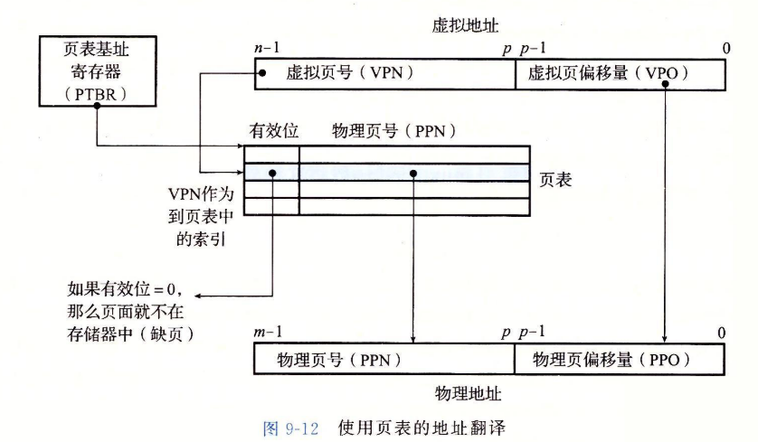

命中

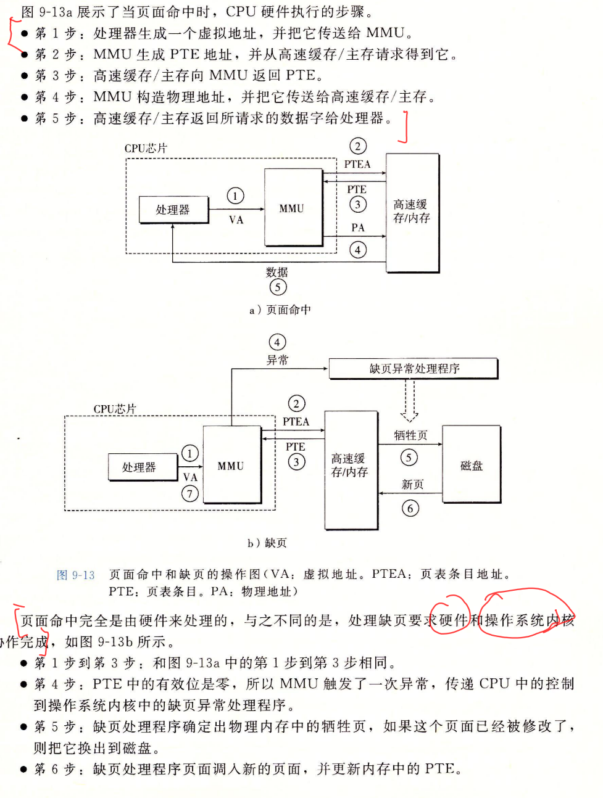

地址翻译发生在高速缓存之前。

#### TLB加速地址翻译

TLB优势在于地址翻译都是在MMU上面完成，速度非常快，是页表缓存，高相联度，在MMU。

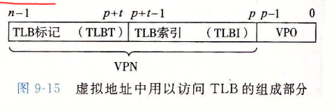

TLB命中和不命中

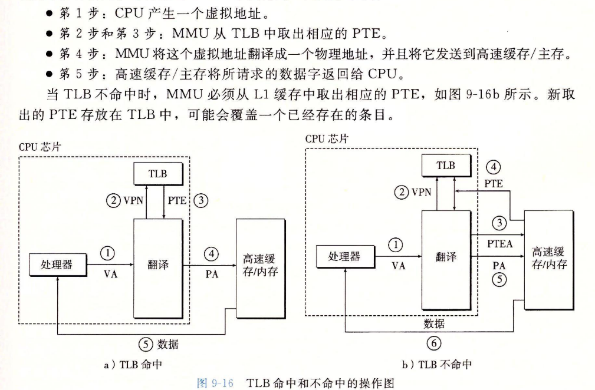

物理地址

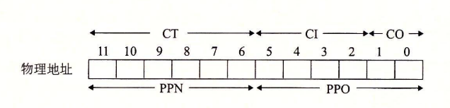

## CoreI7地址翻译

TLB是虚拟寻址的，4路组相联，L1,L2,L3是物理寻址，块大小是64字节。L1，L2是8路组相联，L3是16路组相联

CR3控制寄存器指向第一级页表的起始位置，CR3值是上下文一部分。

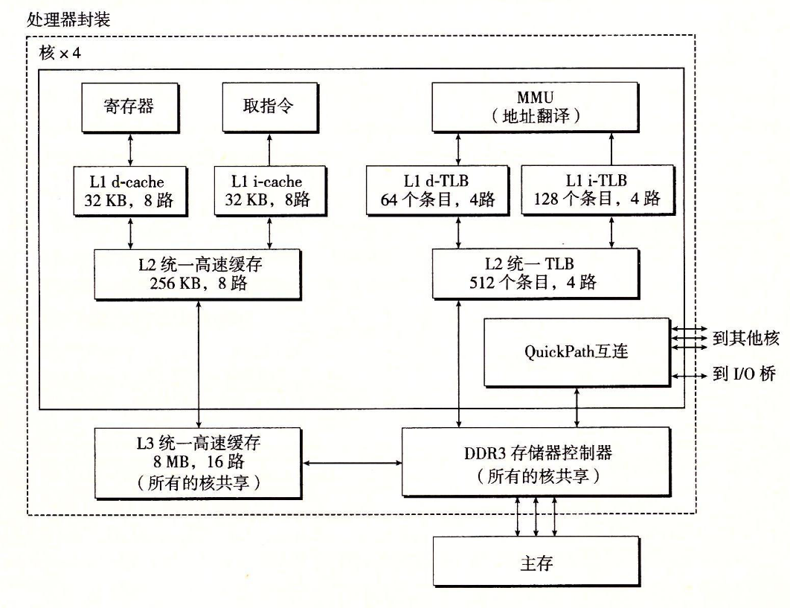

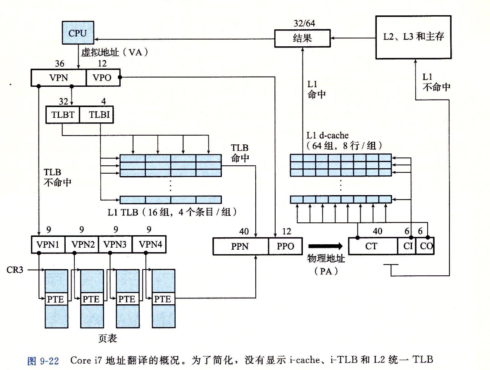

第1，2，3级页表，物理页4kb对齐。页表是四级

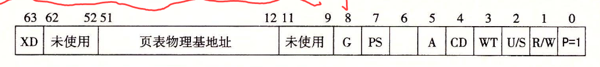

#### Linux进程的虚拟地址空间

linux将内存组织为一些区域集合，pgd指向第一级页表，vm_prot描述这个区域所有页的读写许可权限，vm_flags描述此页面是其他共享还是私有

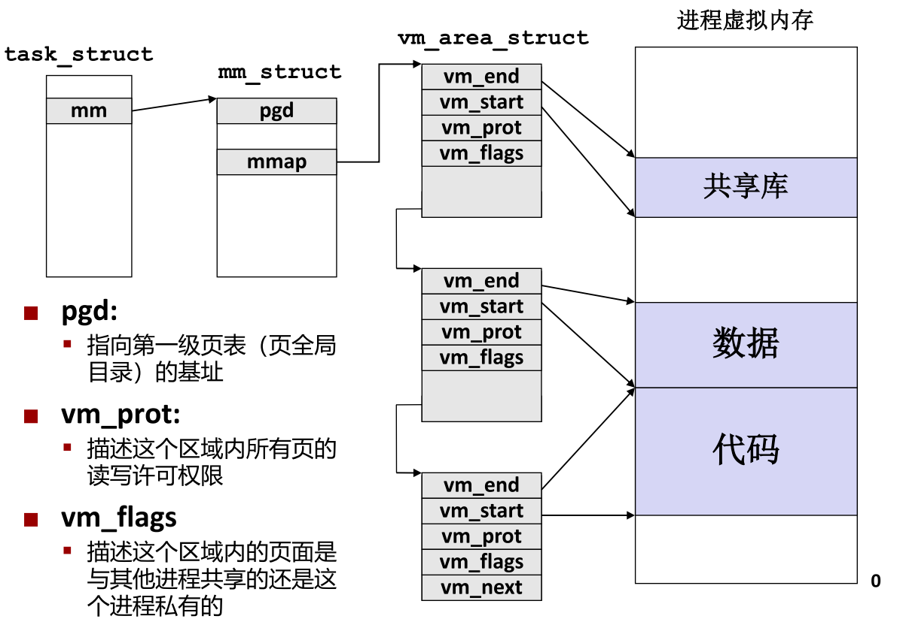

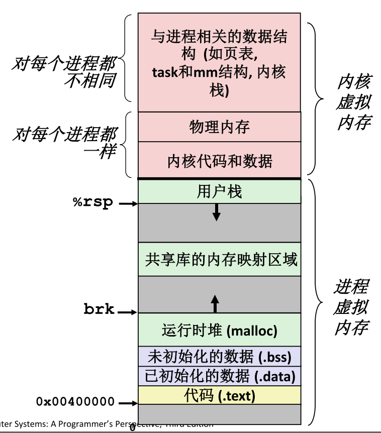

### 内存映射

Linux通过将虚拟内存区域与磁盘上的对象关联起来以初始 化这个虚拟内存区域的内容

根据初始值分为

- **普通文件** （eg可执行目标文件）文件区被分成页大小的片，对虚拟页面初始化（执行按需页面调 度

- **匿名文件** CPU第一次引用该区域内的虚拟页面时会分配一个全是零的物理 页 (demand-zero page请求二进制零的页),修改后和其他页面相同

  

初始化后的页面在内存和交换文件（swap file）之间换来换去，交换空间限制当前进程可分配的虚拟页面总数。

#### 用户级内存映射

mmap映射

解除munmap，删除start开始的length字节区域。再次引用已解除映射区域导致段错误。

### 共享对象

对象映射到虚拟内存的区域，要么作为共享，要么私有。作为共享 物理内存中只有一个 该共享对象的副本。对共享对象写操作可见

私有的写时复制 

- 两个进程都映射 了私有的写时复 制对象

- 读 区域结构被标记 为私有的写时复 制

- 私有区域的页表条目都被标记为 只读

- 写私有页会触发保护故障，故障处理程序创建修改页的副本，故障处理返回指向执行写。尽可能延迟拷贝

- fork就是写时复制机制

  - 为新进程创建虚拟内存 
    - 创建当前进程的的mm_struct, vm_area_struct和页表的原样副 本.
    - 两个进程中的每个页面都标记为只读 
    - 两个进程中的每个区域结构（vm_area_struct）都标记为私有的 写时复制（COW
    - 在新进程中返回时，新进程拥有与调用fork进程相同的虚拟 内存
    - 写时复制

  execve

  - 删除已存在的用户区域
  - 创建新的区域结构
    - 代码和初始化数据映射到.text和.data区（目标 文件提供,在磁盘）
    -  .bss和栈映射到匿名文件
  - 设置pc，指向代码区域入口点
    - Linux根据需要换入代码和数据页面

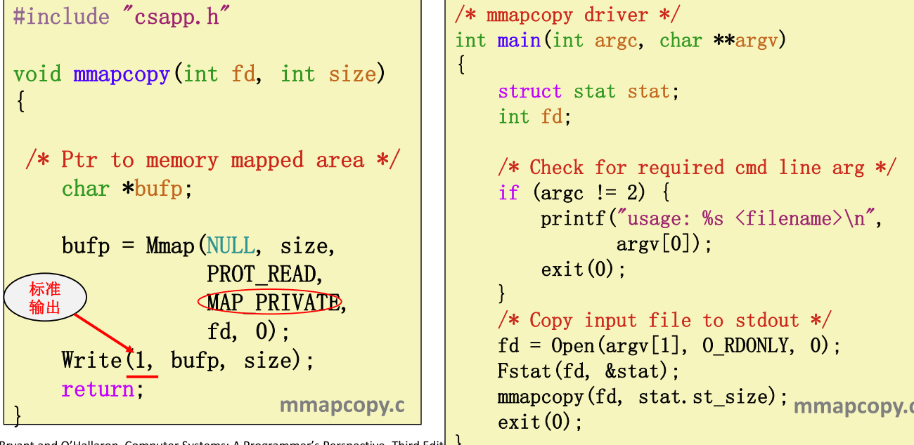

### 动态内存分配

分配器将堆视为一组不同大小的块(blocks)的集合来维 护，每个块要么是已分配的，要么是空闲的

分配器的性能目标

- 吞吐量 每个单位时间内完成的请求数
- 最大化内存利用率 请求Rk 完成后, 聚集有效载荷Pk 为当前已分配的块的有 效载荷之和

知道释放量

- 头部信息

记录，跟踪空闲块

- 隐式空闲链表通过头部中的大小字段隐含地连接空闲块
- 显式空闲链表在空闲块中使用指针连接空闲块
- 分离的空闲链表 
  - 每个大小类的空闲链表包含大小相等的块
- 按照大小排序的块，如平衡二叉树

#### 显式内存分配

> 最小块大小是最小已分配块和最小空闲块大小的最大值，注意最小分配块至少包含1字节的有效载荷，然后考虑对齐问题

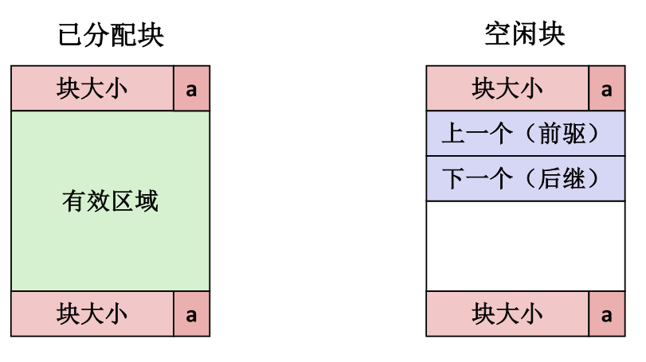

保留空闲块链表, 而不是所有块

- 下一块可能任何地方，需要保存前驱后继
- 还需要合并边界标记，合并空闲块
- 我们只跟踪空闲块，所以我们可以使用有效区域

插入

- LIFO 后进先出，如果使用边界标记可以在常数时间合并
  - 将新释放的块放置在链表的开始处
  - Pro好处: 简单，常数时间 
  - Con不足: 研究表明碎片比地址排序更糟糕
- 地址顺序 
  - 按照地址维护addr(祖先) < addr(当前回收块) < addr(后继)
  - 需要线性时间搜索
  - 但是碎片少于LIFO

相比隐式链表

- 分配时间从块总数的线性时间减少到空闲块数量的线性时间
- 因为需要在列表中拼接块，释放和分配稍显复杂一些
- 每个块需要两个额外的字
- 缺点是空闲块必须足够大，包含所有指针以及可能的头部和脚部。

最常用的链表连接是将分离的空闲链表结合在一起，维护多个不同大小类

#### 隐式内存分配

隐式链表法 

- first fit,next fit,best fit
- 分配空闲块：分割，是否空闲有标志位，为与前面一块合并，需要设置边界标记，且只有空闲才需要

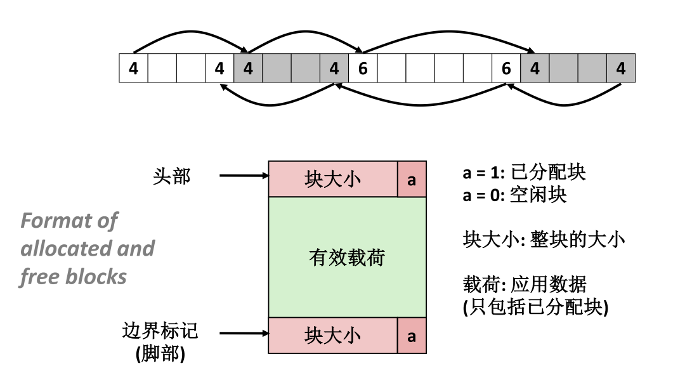

分离的空闲链表

- 简单分离存储，每个大小类的空闲链表包含大小相等的块。**不会合并**，会造成内部和外部碎片。
- 分离适配，维护空闲链表数组，每个和一个大小类相关联。每个链表包含大小不同的块。分配一个块，需要先对合适的空闲链表首次适配，找到了就可选分割，剩余部分插入到适当空闲链表，如果找不到，则搜索下一个更大的。**对分离链表的简单首次适配，内存利用率接近整个堆的最佳适配搜索的内存利用率**
- 伙伴系统，分离适配特例，大小类是2的幂次。一个块地址和伙伴只有一位不同。

### 获取额外堆内存

每个大小类的块构成一个空闲链表。分配器维护空闲链表数组，每个大小类一个空闲链表。

如果分配器无法为请求块分配合适空闲块，

- 合并内存中物理上相邻空间创建更大空闲块
- 否则分配器通过sbrk函数，像内存申请额外堆内存，分配器将额外内存分配为一个大空闲块，插入空闲链表，被请求的块放到这个块内。
  - 向操作系统请求额外的堆内存 (使用sbrk()) 
  - 从这个新的堆内存中分配出n字节 
  - 将剩余部分放置在适当的大小类中

> 分配器使用的任何非标量数据结构都必须保存在堆里
>
> 分配器只能操作改变空闲块
>
> 分配器不能假设分配释放顺序，不能够为性能重排序列或者缓冲请求

malloc不初始化内存，calloc初始化内存，也可以使用sbrk动态伸缩

对于64位地址空间，代码段总是从0x4000开始

### 带边界标记和合并

合并空闲块有两种，

- 立即合并，可以常数内完成，但对于某些请求可能造成抖动，产生不必要和分割和合并。后续讨论是立即合并
- 推迟合并，比如推迟合并，知道某个内存分配请求失败，然后扫描整个堆，合并所有空闲块。快速分配器一般使用

分配器合并

- 带头部的空闲隐式链表是free和堆大小线性关系

- 带边界标记合并，可以实现常数时间合并
  - 在每个块后加入一个脚部，分配器通过检查脚部，判断前面一个块的起始位置和状态。注意只有当前面块空闲时，才会用到脚部。已分配的块就不需要脚步了。

### 简单分配器设计

C和C++是保守分配器的根本原因是它不用类型信息标记内存位置，对int无法判断是指针还是数，而Lisp和Java则是维护的是可达图的精确表示

### 垃圾收集

垃圾收集器视作内存为一张有向可达图，图节点分为一组根节点和一组堆节点。堆节点对应一个已分配块。有向边这表示P中某个位置指向另一个块。根节点对应不在堆的位置（可以说寄存器，栈变量或者虚拟内存读写区域的全局变量）。包含指向堆的指针。

垃圾收集维护可达图某种表示，通过释放不可达点返回空闲链表，实现定期回收

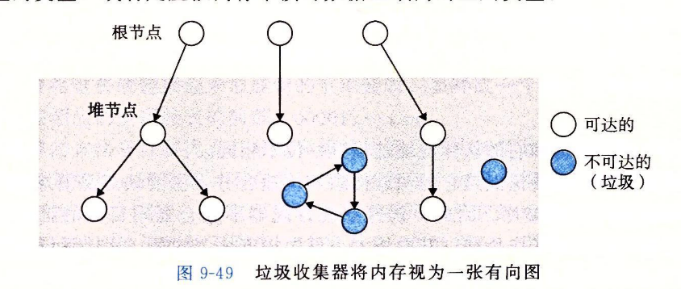

保守的垃圾收集

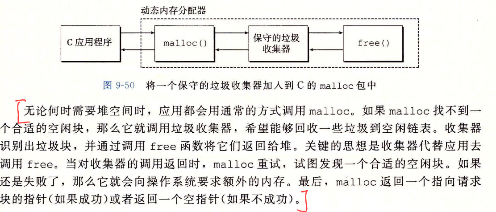

#### Mark&sweep

此收集器由标记和清除两阶段组成，标记出根节点所有可达和已分配后继

而清除释放了每个未标记的已分配块。

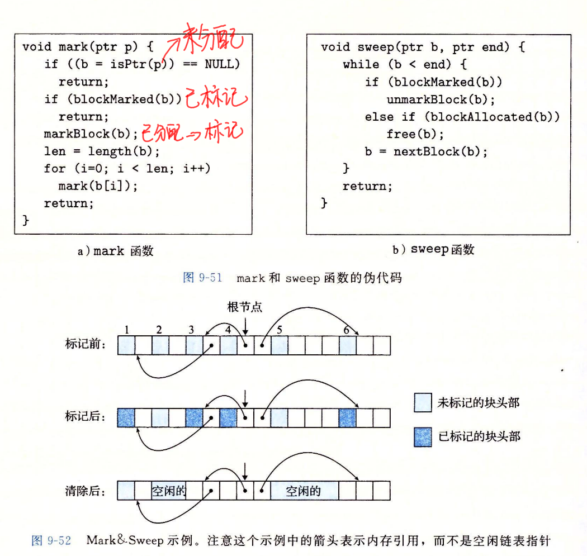

C语言使用保守的marksweep，因为**C语言不用任何类型信息标记内存位置**，故isPtr无法判断事发后指针，而且就算是指针，也无法明显判断p是否指向已分配快的有效内存位置（c通过平衡二叉树实现，左子树低地址）

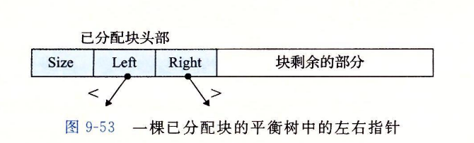

### c内存有关错误

- 间接使用坏指针 ，进程的虚拟地址空间有较大的洞，没有映射到任何有意义的数据。如果尝试引用这类指向空洞指针，操作系统就会异常终止。而且虚拟内存有些区域只是可读，试图写此区域也会异常终止 如scanf("%d",val)尝试写地址
- 读未初始化内存。malloc分配内存并未初始化。堆内存需要显示初始化，用calloc
- 允许栈缓冲区溢出。若程序不检查栈大小直接写入栈，可能溢出。
- 假设指针和指向对象大小相同
- 造成错位错误，可能覆盖，也就是越界
- 引用指针，而不是对象 $*size--与 *(size)--$
- 引用不存在变量
- 误解指针运算
- 引用空闲堆块数据
- 内存泄漏

