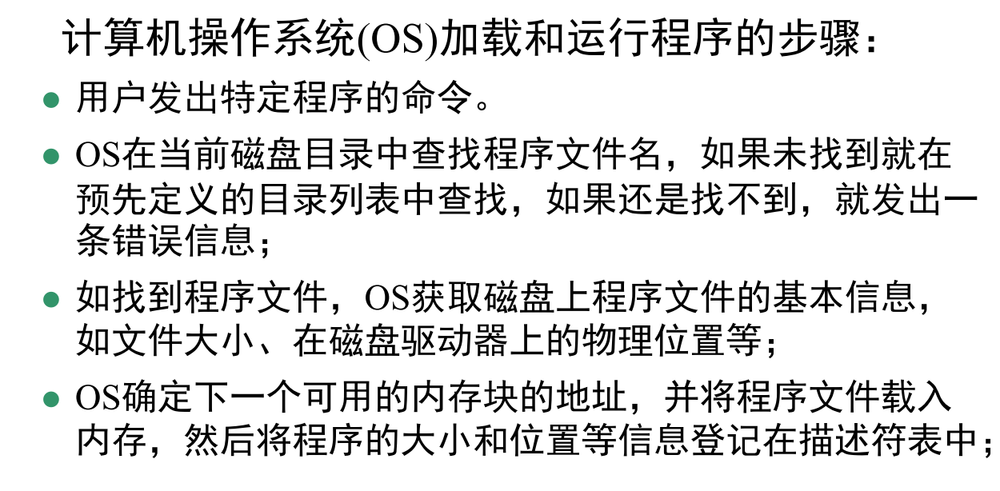
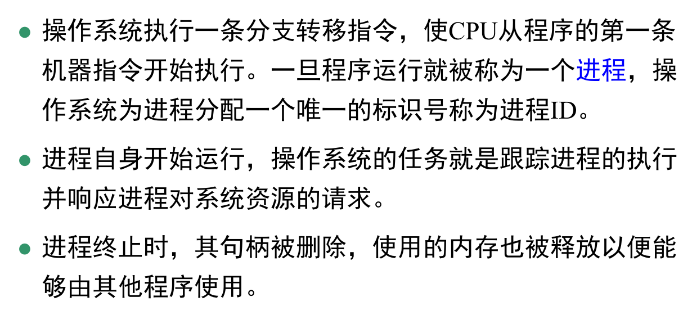
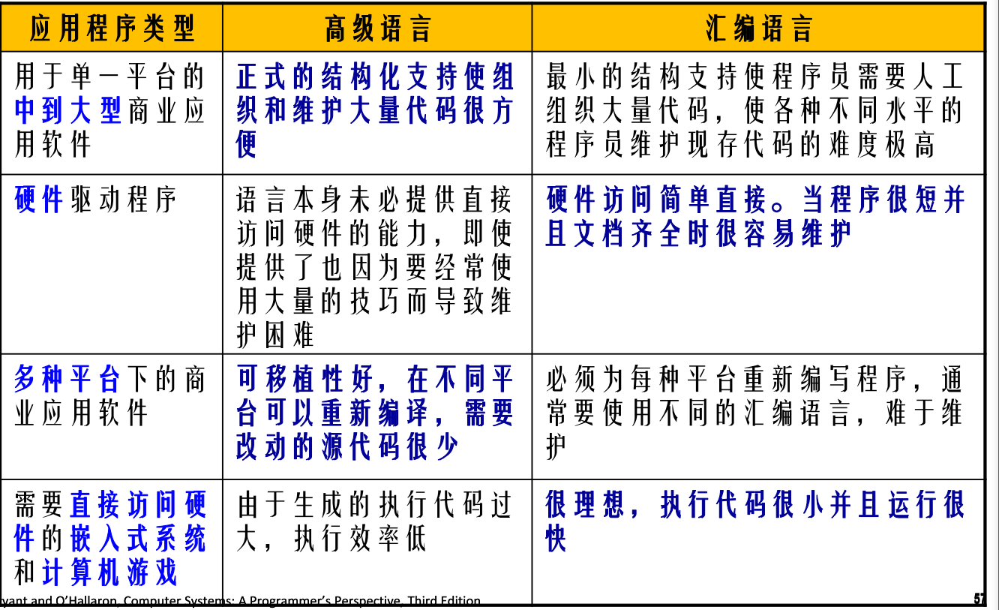

# 典型例子

[TOC]

### hello word执行过程 结合fork，shell

1. shell输入./hello
2. shell命令行解释器构造参数argv,envp
3. 调用fork创建子进程，地址空间和父进程完全相同
4. 调用execve函数，再当前新建的子进程上下文加载并运行子程序。将.text，.data,.bss等节加载到当前进程的虚拟地址空间
5. 调用hello的main函数，再一个进程上下文运行

### 流水线工作

### 链接流程

### 虚拟地址翻译过程

1. 处理器吧虚拟地址VA发送给MMU,MMU将VA的VPN，生成页表项地址，发送给高速缓存
2. 检查页表项的有效位，若为0，触发异常缺页，执行缺页异常处理程序。缺页处理程序选择牺牲页，若牺牲页被修改则写回。
3. 再从磁盘中调出新页，更新页表项PTE
4. 重新执行导致缺页的指令

### Y86-64结构

数据冒险：指令使用寄存器 R 为目的，瞬时之后使用 R 寄存器为源。处理
方法有

- 暂停： 通过在执行阶段插入气泡（bubble/nop），使得当前指令执行暂停
  在译码阶段
- 数据转发：增加 valM/valE 的旁路路径，直接送到译码阶段；
- 加载使用冒险：指令暂停在取指和译码阶段，在执行阶段插入气泡（bubble/nop）

- 控制冒险
  - ret：在 ret 后插入 3 个 bubble。 暂停 
  - 预测分支错误：在条件为真的地址 target 处的两条指令分别插入 1 个 bubble 正常+气泡+气泡

汇编语言和高级语言比

### shell

- shell在linux是交互型应用级程序，代表用户运行程序，是命令行解释器。基本功能是解释运行用户的指令，重复执行
  - 终端进程读取用户从键盘输入命令行
  - 分析命令行，获取参数，构造参数并传递给exceve的argv向量
  - 调用fork创建子进程
  - 检查第一个是否为内置shell命令
  - 不是则子进程用上面构造的参数，调用exceve执行指定程序
  - 如果没要求后台运行，shell使用waitpid等待作业终止返回
  - 如果要求，则shell返回。

- x86是CISC

