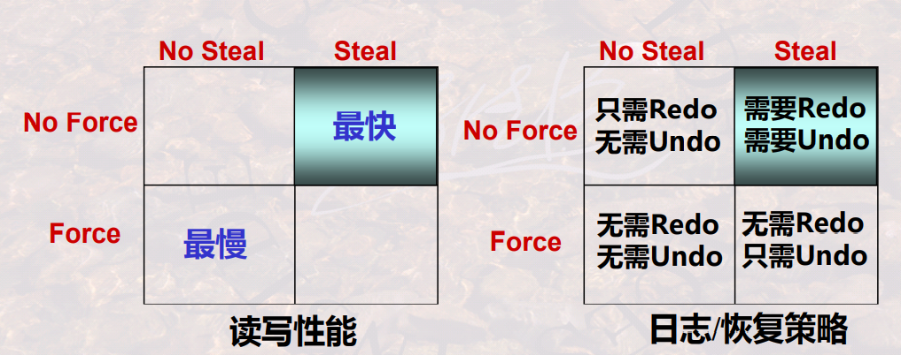
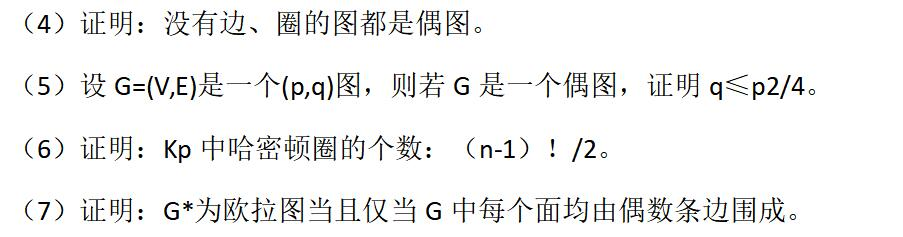
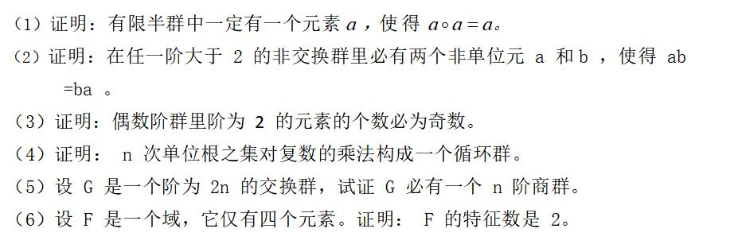

考研面试哈工大

[TOC]

##  智力问答

http://www.360doc.cn/mip/4834850.html

往年问题：

https://blog.csdn.net/qq_32963855/article/details/106180513

http://cskaoyan.com/thread-659383-1-1.html

http://www.doc88.com/p-1778509601392.html

## 数据库

## 数据库系统的分层抽象

外模式（用户模式）

概念模式（逻辑模式，包含关联约束）

内模式（存储路径，存放方式、索引方式）

外模式\模式 、内模式\模式

聚集函数是不允许用于Where子句中的：Where子句是对每一元组进行条件过滤，而不是对集合进行条件过滤

not in 和<>all等价

数据字典：用户创建，包含表和视图，存储有关数据项的数据，为数据库提供了路线图，而不是原始数据。数据库数据字典存放在system表空间。(数据的数据项、数据结构、数据流、数据存储、处理逻辑等进行定义和描述)

### 范式

- 1NF:关系的每个分量都是不可分的数据项
- 2NF:U中的每一非主属性完全函数依赖于候选键
- 3NF:消除了非主属性对侯选键的传递依赖
- BCNF: A->B （B不属于A）则A必然含有候选键
- 4NF:消除了非主属性对候选键以外属性的多值依赖

### 索引

索引文件组织方式

1.排序 2.散列

主文件组织方式：堆文件、排序文件、散列文件、聚簇文件

索引文件是一种辅助存储结构，其存在与否不改变存储表的物理存储结构；然而其存在，可以明显提高存储表的访问速度。

稀疏索引：每个存储块有一个索引项-主索引

稠密索引：每一个记录(形成的每一个索引字段值)，都有一个索引项和它对应，指明该记录所在位置

#### 主索引和辅助索引

一个主文件仅可以有一个主索引，但可以有多个辅助索引

主索引通常建立于主码/排序码上面；辅助索引建立于其他属性上面

可以利用主索引重新组织主文件数据，但辅助索引不能改变主文件数据

主索引是稀疏索引，辅助索引是稠密索引

#### B+树

B+树：每个索引块的指针利用率都在50%-100%之间

### 并发控制

事务特性:

$$ACID$$:原子性，一致性，隔离性，持久性

三种不一致：

1.丢失修改  后一次修改覆盖前一次

2.不能重复读  两次读取数据不一致

3.脏读（数据回滚，之前读取的数据无用）

两大类并发控制方法：

1.基于封锁法

2.基于撤回法

可串行性：一个调度对数据库状态影响和某个串行调度相同，则为可串行

冲突：有冲突的两个操作是不能交换次序的，没有冲突的两个事务是可交换的

冲突可串行性： 一个调度，如果通过交换相邻两个无冲突的操作能够转换到某一个串行的调度，则称此调度为冲突可串行化的调度(可用构造有向图判断)

并发调度的正确性 >可串行性 > 冲突可串行性

### 基于封锁的判断方法

分为排他锁、共享锁、更新锁、增量锁

幻读：事务不是串行发生的一种现象，是事务A读取事务B的新增数据。

> 第一个事务对一个表的所有数据进行修改，同时第二个事务向表中插入一条新数据。那么操作第一个事务的用户就发现表中还有没有修改的数据行，就像发生了幻觉一样。解决幻读的方法是增加范围锁（range lock）或者表锁

#### 三级封锁协议

- 一级封锁协议：事务T要修改数据A时必须加X锁，直到T结束才释放锁。防止同时修改,可解决丢失修改问题，因不能同时有两个事务对同一个数据进行修改，那么事务的修改就不会被覆盖。

- 二级封锁协议：在一级的基础上，要求读取数据 A 时必须加 S 锁，读取完马上释放 S 锁。防止修改时读取,可解决 丢失修改 和 读脏数据 问题，因为一个事务在对数据 A 进行修改，根据 1 级封锁协议，会加 X 锁，那么就不能再加 S 锁了，也就是不会读入数据。

- 三级封锁协议：在二级的基础上，要求读取数据 A 时必须加 S 锁，直到事务结束了才能释放 S 锁。防止读取时修改,可解决 丢失修改 和 读脏数据 问题，还进一步防止了 不可重复读 的问题，因为读 A 时，其它事务不能对 A 加 X 锁，从而避免了在读的期间数据发生改变

#### 两段封锁协议

两阶段：加锁段，解锁段。加锁段中不能有解锁操作，解锁段中不能有加锁操作

### 基于时间戳

如无冲突，予以执行；如有冲突，则撤销事务，并重启该事务，此时该事务获得了一个更大的时间戳，表明是后执行的事务。

### 基于有效性确认的并发控制

1. 事务在启动时刻被赋予唯一的时间戳，以示其启动顺序
2. 为每一活跃事务保存其读写数据的集合，RS(T)：事务T读数据的集合；WS(T)：事务T写数据的集合。
3. 通过对多个事务的读写集合，判断是否有冲突(存在事实上不可实现的行为)，即有效性确认，来完成事务的提交与回滚，强制事务以可串行化的方式执行

分为三个阶段：读阶段，有效性确认阶段，写阶段

调度器维护三个集合：START 、VAL 、FIN

FIN(U)>START(T)的U,检测:RS(T) 交WS(U)是否为空。若为空，则确认。

FIN(U)>VAL(T)的U, 检测：WS(T) 交WS(U)是否为空。若为空，则确认。否则，不予确认

### 数据库故障恢复

事务故障：重做撤销事务

系统故障：运行日志，检查点(在该时刻, DBMS强制使内存DB Buffer中的内容与介质DB中的内容保持一致，即将DB Buffer更新的所有内容写回DB中)

介质故障:转储点(对数据库在其他介质存储上产生的另一份等同记录)

缓冲区处理策略：最常用No Force、 steal

Force：内存中的数据最晚在commit的时候写入磁盘。
No steal：不允许在事务commit之前把内存中的数据写入磁盘。
No force：内存中的数据可以一直保留，在commit之后过一段时间再写入磁盘。(此时在系统崩溃的时候可能还没写入到磁盘，需要Redo)。--灵活
Steal：允许在事务commit之前把内存中的数据写入磁盘。(此时若系统在commit之前崩溃时，已经有数据写入到磁盘了，要恢复到崩溃前的状态，需要Undo）。--灵活

Undo日志只保留旧值，**从日志的尾部开始按日志记录的反序，处理每一日志记录，撤销未完成事务的所有修改**

Redo只保留新值，**从日志的起始位置开始按日志记录的正序处理每一日志记录，重做已提交事务的所有修改**

## 离散数学

### 集合论、图论

康托定理：无穷集合无最大集合，但是有最小，为自然数集

商集：指由集合和该集合上的等价关系导出的集合

偶图判定：任意圈长为偶数

欧拉图判定:连通，任意点度数为偶数

哈密顿图判定:1.直接走 2.染色 3.任意两点度数之和大于等于p 4.非平面哈密顿图判定

平面图判定：1.欧拉公式 2.展开 3.是否含有和$K_{3,3}、K_{5}$同胚的子图

k正则树计算: 

### 近世代数

> 记录一些比较容易忘记的 

整环：无零因子环，含幺环，交换环

拉格朗日定理：设 G 是一个阶为 N 的有限群，H 是群 G 的一个 n 阶子群，则

$N=n*[G:H]$

代数系得同余关系：

在环$R(,+,*)$中，加法单位元用0表示，称为R的零元

体：至少含有一个非零元素，非零元素全体对乘法构成群

域：可换体

至少含有一个非零元素的无零因子有限环是体

主理想：由一个元素生成的理想

体（域）中只有理想，它们是{0}和体（域）自身。

> 虽然大概率不考，还是参考下群友的预测
>
> 
>
> 

### 数理逻辑

PC公理系统和FC公理系统

## 改错常见错误

1. for、while,if，函数定义处加;
2. for循环;改，
3. 指针类型错误
4. 循环条件错误，比如&&为||，比如><
5. 边界判断错误

## 算法

dp\回溯\分支限界\贪心\递归\分治

主方法计算时间复杂度

NP,P,NPC问题

## 操作系统

#### 面包店算法

是解决多个[线程](http://zh.wikipedia.org/wiki/线程)[并发](http://zh.wikipedia.org/w/index.php?title=并发程序设计&action=edit&redlink=1)访问一个共享的单用户资源的[互斥](http://zh.wikipedia.org/wiki/互斥锁)问题的算法，先到的会有较小的号码，如果号码相同就线程Id较小的，进入临界区后，号码置0

#### 进程、线程

进程通信：共享内存、管道、命名管道、消息队列、套接字、信号

进程调度算法：FIFS 、SJF、优先级调度、时间片轮转、最高响应比、多级反馈队列

进程同步：互斥量、信号量、事件、临界区

死锁条件：1.互斥访问 2.不剥夺 3.请求保持 4.循环等待

饥饿和死锁：死锁进程必须多2，死锁一定是阻塞，但是饥饿可以是就绪

#### 文件逻辑结构

- 顺序结构：顺序存放记录，增加删除一个记录比较困难
- 索引结构：在索引表中存放记录，方便快速查找
- 索引顺序结构：先将记录分组，在用索引表记录

#### 文件物理结构

如何存放在外存

- 连续分配：文件会在磁盘上占用一组连续的块
- 链接分配：用链接或者文件分配表实现离散分配
- 索引分配：每个文件家里一张索引表，如果索引表过大，可以采用多级索引的方式

#### 文件存储空间

如何管理外存空闲块

- 空闲表法
- 空闲链表
- 位视图法
- 成组链接法（大型文件系统）

#### IO控制方式

- 程序直接控制
- 中断驱动控制
- DMA
- 通道控制

#### Cache读写

直写+非写分配、写回+写分配

